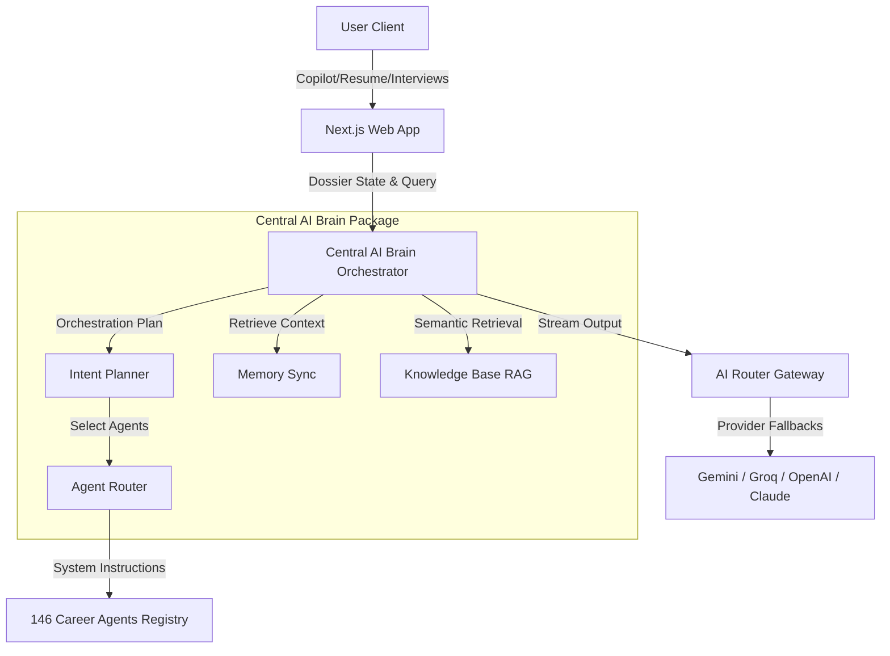

# Career Agents v4.0.0 — System Architecture

This document describes the unified v4.0.0 architecture which transitions Career Agents into a centralized AI Career Operating System.

## 1. Core Component Interfaces

### A. Central AI Brain (`packages/brain/`)
The centralized coordinator that replaces isolated prompts with a structured multi-phase execution pipeline.
1. **Entrypoint (`brain.ts`)**: Routes message requests, consolidates candidate dossier facts, triggers semantic text query matching, and maps timelines.
2. **Planner (`planner.ts`)**: Dynamically reads input tokens and aligns matching agent categories to generate execution timeline plans.
3. **Router (`router.ts`)**: Resolves agent templates directly from the workspace filesystem (`agent-registry.json`).
4. **Context Engine (`context.ts`)**: Compiles name, target role, target company, scores, learning streaks, and ATS metrics into structured system prompts.
5. **Memory Manager (`memory.ts`)**: Translates client-side Zustand store changes into permanent dossier profiles.
6. **Skills Index (`skills.ts`)**: Identifies agent alignment against the master taxonomy of developer capabilities.
7. **RAG Knowledge Base (`knowledge.ts`)**: Indexes uploaded PDFs, repositories, text, and spreadsheets using paragraph chunking and BM25-like token queries, yielding formatted citations.
8. **History Summarizer (`summary.ts`)**: Compresses older logs when chat context lengths exceed provider limit thresholds.

### B. Client-Side Workspace Memory
- State variables are managed within a persistent Zustand store (`apps/web/src/lib/store.ts`) and cached locally in browser storage.
- Every workspace action (interview reviews, resume parses, application pipelines) updates this store, providing the Brain with real-time dossier memory.

---

## 2. Integrated Feature Pipelines

### A. AI Copilot 2.0 & Vision
- Unified document parsing occurs on `/api/parse-file` supporting image base64, PDFs, ZIP repositories, and JSON templates.
- Thinking tags are parsed to render a visual execution timeline card showing the team of active agents, elapsed latency, and confidence gauges.

### B. Live Interview Lab & Voice Diagnostics
- Integrates voice/camera mock practice checklists evaluation criteria (eye contact indicators, speak speed, structured STAR format checks) inside mock rounds.

### C. Coding Playground
- Integrated compiler interfaces let candidates write TypeScript, Python, Javascript, Go, Rust, Java, and C++ code with real-time AI performance analysis.
