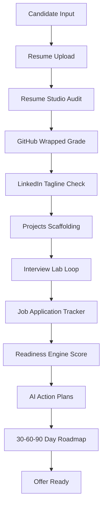
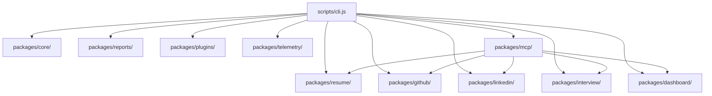

# Career-Agents

The Open Source Career Operating System

<p align="center">
  
</p>

<p align="center">
  <a href="https://www.npmjs.com/package/career-agents"></a>
  <a href="./LICENSE"></a>
  <a href="https://nodejs.org"></a>
  <a href="https://github.com/karthikrshet/Career-Agents/actions"></a>
  <a href="https://www.npmjs.com/package/career-agents"></a>
  <a href="https://github.com/karthikrshet/Career-Agents"></a>
</p>

---

## What is Career-Agents?

Career-Agents is an open-source Career Operating System designed to modularize, audit, and automate professional growth tasks. It replaces unstructured prompting guides and static texts with an integrated CLI utility, stdio Model Context Protocol (MCP) server, and Next.js visual dashboard.

The system analyzes resumes for ATS compliance, reviews public GitHub portfolios for engineering quality, audits LinkedIn taglines, and runs interactive STAR behavioral interview loops. By connecting all diagnostic indicators into a single profile state database, it calculates a cumulative Career Readiness Score and outputs custom 30-60-90 day roadmap plans.

---

## Animated Product Preview

For a visual demonstration of the interactive dashboard, upload portals, and interview loops in action:
- **Core Dashboard Preview**: Refer to `./docs/images/dashboard_preview.gif` (interactive gauges and goals).
- **Resume Studio Pro**: Refer to `./docs/images/resume_studio_preview.gif` (drag-and-drop parsing and weak bullet edits).
- **GitHub Wrapped**: Refer to `./docs/images/github_wrapped_preview.gif` (stars counters and heatmaps).
- **LinkedIn Optimizer**: Refer to `./docs/images/linkedin_optimizer_preview.gif` (tagline pipe rewrites).
- **Mock Interview Lab**: Refer to `./docs/images/mock_interview_preview.gif` (readline loop and integrated coding board).

---

## Features

### 1. Resume Studio
- **Description**: Parses PDF, DOCX, and TXT files. Detects formatting blockers, passive verbs, and missing keyword density.
- **Command**: `career-agents review resume.pdf`
- **Expected Output**: List of weak bullets, suggested STAR rewrites, and layout compatibility ratings.
- **Architecture**: Mapped inside `packages/resume/` (`file-parser.js`, `scorer.js`, `studio.js`, `faang.js`).

### 2. GitHub Portfolio Analyzer
- **Description**: Grades public repositories description, language coverage, readme quality, and project traction indicators.
- **Command**: `career-agents github karthikrshet`
- **Expected Output**: Repository star/fork counts, language distribution percentages, and readme suggestions.
- **Architecture**: Mapped inside `packages/github/` (`analyzer.js`).

### 3. LinkedIn Optimizer
- **Description**: Critiques tagline headers and summary narratives to raise search visibility indexes.
- **Command**: `career-agents linkedin profile.txt`
- **Expected Output**: Alternative pipe tagline formats and key competency recommendations.
- **Architecture**: Mapped inside `packages/linkedin/` (`analyzer.js`).

### 4. Mock Interview Lab
- **Description**: Interactive STAR loop behavioral questions loop and integrated technical coding board.
- **Command**: `career-agents mock google coding`
- **Expected Output**: Step questions prompts, response logging, and grading feedback scorecard.
- **Architecture**: Mapped inside `packages/interview/` (`engine.js`).

### 5. Job Application Tracker
- **Description**: Track salary, locations, dates, and status stages (Wishlist, OA, Interview, Offer, Rejected) in a clean Kanban board.
- **Architecture**: Mapped inside `packages/dashboard/` (`profile-manager.js`, `dashboard.js`).

### 6. Company Preparation Hub
- **Description**: Milestone checklists mapping DSA topics, system design, and behavioral modules for Google and Stripe.
- **Architecture**: Mapped inside `packages/core/` (`roadmap.js`).

### 7. Career Copilot
- **Description**: Conversational AI assistant accepting prompts shortcuts ("Review resume", "Prep for Google") to generate roadmaps.
- **Architecture**: Exposes global CLI/MCP integrations with live LLM API keys.

---

## Career OS Workflow

The system implements a connected journey mapping candidate readiness:



---

## Screenshots

- **System Dashboard**: `./docs/images/dashboard.png` (dials and funnel)
- **Resume Studio Pro**: `./docs/images/resume_studio.png` (upload and weak bullets rewrite)
- **GitHub wrapped**: `./docs/images/github_wrapped.png` (stars metrics and grids)
- **LinkedIn Optimizer**: `./docs/images/linkedin_optimizer.png` (tagline suggestions)
- **Interview Lab Console**: `./docs/images/interview_lab.png` (timer and code editor board)
- **Job Tracker**: `./docs/images/job_tracker.png` (funnel table list)
- **Prep Hub**: `./docs/images/prep_hub.png` (DSA and design checkpoints)
- **Career Copilot**: `./docs/images/copilot.png` (conversational loop chat)
- **Report Exporter**: `./docs/images/report_exporter.png` (HTML visual card exports)

---

## Installation

### 1. Global Installation (NPM)
```bash
npm install -g career-agents
```

### 2. Local Source Setup
```bash
git clone https://github.com/karthikrshet/Career-Agents.git
cd Career-Agents
npm install
python scripts/generate-data.py
python scripts/validate.py
```

---

## Quick Start

Verify setup health and review a resume:

```bash
career-agents doctor
career-agents list
career-agents recommend --skills "react"
career-agents review resume.pdf
career-agents github karthikrshet
career-agents dashboard
career-agents mock google behavioral
```

---

## CLI Reference

| Command | Description | Example | Expected Output |
| :--- | :--- | :--- | :--- |
| `career-agents doctor` | Check environment variables and path settings | `career-agents doctor` | Environment diagnostics OK |
| `career-agents list` | List registered divisions and workflows | `career-agents list` | Available Divisions: 19 |
| `career-agents dashboard` | Render visual gauges of profile indices | `career-agents dashboard` | Cumulative Readiness Index |
| `career-agents review <file>` | Audit layout and bullets metrics | `career-agents review resume.pdf` | Formatting audits & weak bullets list |
| `career-agents github <user>` | Grade repositories and README guidelines | `career-agents github karthikrshet` | Language stats & pinned repos grades |
| `career-agents mock <co> [mode]`| Start conversational behavioral loops | `career-agents mock stripe technical` | STAR question loops and scorecard |

---

## Web Dashboard

The Next.js React application compiles all modules into a single browser frame:
- **Core Dashboard**: Monitors child scores and weekly targets checkbox logs.
- **Resume Studio**: Provides textareas and drag-and-drop uploads to run ATS audits.
- **GitHub Wrapped**: Renders language percentages and contribution map grids.
- **LinkedIn Optimizer**: Provides pipe taglines and summary rewrite templates.
- **Interview Lab**: Combines conversational timers, code editor panes, and scorecards.
- **Job Tracker**: Renders funnel pipeline stats and jobs tables.
- **Company Preparation**: Checkpoints DSA topics and system design modules.
- **Career Copilot**: Natural chat log providing query shortcuts.

---

## Model Context Protocol (MCP) Support

The Stdio-based MCP server exposes resources and tools directly to LLMs. Config blocks:

### 1. Claude Desktop Setup
Add details under `%APPDATA%/Claude/claude_desktop_config.json`:
```json
{
  "mcpServers": {
    "career-agents": {
      "command": "npx",
      "args": ["-y", "career-agents", "mcp"]
    }
  }
}
```

### 2. Cursor Setup
Navigate to Settings &rarr; Features &rarr; MCP &rarr; Add New MCP Server:
- **Name**: `career-agents`
- **Type**: `stdio`
- **Command**: `npx -y career-agents mcp`

See [MCP Guide](./docs/MCP_GUIDE.md) for Windsurf and VS Code details.

---

## Plugin Architecture

The plugin manager dynamically scans the local `plugins/` directory to load commands:
- **Lifecycle**: Scan directory `plugins/*.js` &rarr; import ES module dynamically &rarr; register execution hooks in global switch.
- **Schema**: Plugins must export `name`, `description`, and an async `execute(args)` controller.

Refer to [Plugin Guide](./docs/PLUGIN_GUIDE.md) for code implementation examples.

---

## Repository Architecture



- **packages/core/**: Runtime execution engines and 30-60-90 day roadmaps.
- **packages/resume/**: Extends parsing, bullet STAR auditing, and FAANG criteria.
- **packages/dashboard/**: Profiles manager serializing state parameters.
- **packages/reports/**: Compiles Markdown and visual HTML cards outputs.
- **Runtime Flow**: CLI dynamic imports load packages dynamically when routed, optimizing startup times.
- **State Flow**: Individual module updates write properties to `.career-profile.json` shared indices, which updates the Core Dashboard.
- **Report Generation**: Scans diagnostic objects to format HTML layouts and save them under `exports/reports/`.

---

## Documentation

Comprehensive Technical Manuals (no emojis):
- **[Architecture Guide](./docs/ARCHITECTURE.md)**: Package bounds and flows.
- **[CLI Reference Guide](./docs/CLI_REFERENCE.md)**: Syntax commands catalog.
- **[MCP Integration Guide](./docs/MCP_GUIDE.md)**: Stdio server configurations.
- **[Developer Plugin Guide](./docs/PLUGIN_GUIDE.md)**: Custom commands registration.
- **[Dashboard Guide](./docs/DASHBOARD_GUIDE.md)**: State synchronization detail.
- **[Resume Studio Guide](./docs/RESUME_GUIDE.md)**: ATS scoring rules.
- **[GitHub Analyzer Guide](./docs/GITHUB_GUIDE.md)**: Repository grading metrics.
- **[LinkedIn Optimizer Guide](./docs/LINKEDIN_GUIDE.md)**: Search visibility index.
- **[Interview Lab Guide](./docs/INTERVIEW_GUIDE.md)**: Readline simulation loop.
- **[Job Tracker Guide](./docs/JOB_TRACKER_GUIDE.md)**: Applications status tracking.
- **[FAQ Reference](./docs/FAQ.md)**: Frequently asked questions.
- **[Troubleshooting Guide](./docs/TROUBLESHOOTING.md)**: Diagnostics and path fixes.
- **[Showcase Examples](./docs/EXAMPLES.md)**: Input/output files index.

---

## Roadmap

- **v1.3.1**: Target preparation tracks configurations. (Completed)
- **v1.4.0 (Milestone 1)**: Packages restructuring, features flagging, and Resume Studio. (Completed)
- **v2.0.0 (Milestone 2-7)**: Full connected visual dashboard, Job Tracker, Company Prep tracks, and complete technical documentation guides. (Current)

---

## Community

- **Discussions**: Ask questions on GitHub Discussions.
- **Issues**: Report bugs or suggest company tracks in GitHub Issues.
- **Support**: Read the Support policy for contacts.

---

## License

This project is licensed under the MIT License - see the [LICENSE](./LICENSE) file for details.
