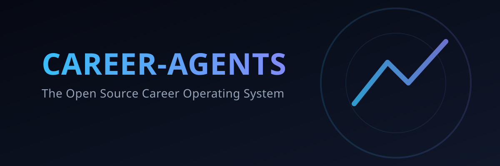
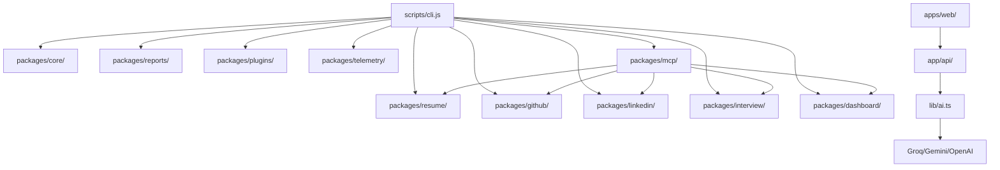

# Career-Agents

The Open-Source Career Operating System (Career OS)

<p align="center">
  
</p>

<p align="center">
  <a href="https://www.npmjs.com/package/career-agents"></a>
  <a href="./LICENSE"></a>
  <a href="https://nodejs.org"></a>
  <a href="https://github.com/karthikrshet/Career-Agents/actions"></a>
  <a href="https://www.npmjs.com/package/career-agents"></a>
  <a href="https://github.com/karthikrshet/Career-Agents"></a>
</p>

---

## 🚀 Overview

**Career-Agents** is an open-source **Career Operating System (Career OS)** designed to modularize, audit, and automate professional growth tasks. It replaces unstructured prompt structures and static text templates with a unified CLI utility, an stdio-based **Model Context Protocol (MCP)** server, and a premium **Next.js web dashboard**.

The system parses resumes for ATS compatibility, audits public GitHub repositories, analyzes LinkedIn profile copy, and runs mock STAR interviews. By synchronizing all metrics into a local profile state, it calculates an overall **Career Readiness Score** and generates custom actionable roadmaps.

---

## 🎨 Visual Interface & Modules

The platform is divided into core feature modules that work seamlessly together:

### 1. Resume Studio
* **ATS Reviewer**: Analyzes formatting blockers (multi-column, tables, icons) that trip up parsing systems.
* **Weak Bullet Auditor**: Identifies weak action verbs and missing metrics, suggesting instant STAR (Situation, Task, Action, Result) revisions.
* **FAANG Calibrator**: Validates signaling against target company competencies.

### 2. GitHub Analyzer
* **Portfolio Scorer**: Computes language diversity, contribution maps, and repository description completeness.
* **README Auditor**: Scores documentation visibility and project packaging benchmarks.

### 3. LinkedIn Optimizer
* **Tagline Generator**: Provides professional pipe-separated headline formats.
* **Visibility Auditor**: Computes search indexing density and flag patterns.

### 4. Mock Interview Lab
* **STAR Simulator**: Conducts mock interviews in the CLI or Web Dashboard using the STAR framework.
* **Integrated Code Board**: Code editing panel for technical and system design rounds.
* **Scorecard Evaluation**: AI evaluates response content and communication quality.

---

## 💻 Visual Product Preview

For a demonstration of features, guides, and layouts in action:
* **Interactive Dashboard**: Refer to `./docs/images/dashboard_preview.gif`.
* **Resume Studio**: Refer to `./docs/images/resume_studio_preview.gif`.
* **GitHub Audit**: Refer to `./docs/images/github_wrapped_preview.gif`.
* **LinkedIn Optimizer**: Refer to `./docs/images/linkedin_optimizer_preview.gif`.
* **Mock Interview Lab**: Refer to `./docs/images/mock_interview_preview.gif`.

---

## 🛠️ CLI Reference

### 1. General Diagnostic and Info
* **List**: `career-agents list` — Lists registered divisions, workflows, and available agent coaches.
* **Doctor**: `career-agents doctor` — Verifies Node.js path settings, environment config, and dependencies.
* **Recommend**: `career-agents recommend --skills "react,node"` — Recommends career coaches and tracks.

### 2. Resume Review
* **Review**: `career-agents review resume.pdf` — Run full ATS and formatting scanner.
* **Score**: `career-agents score resume.pdf` — Calculates ATS compatibility score (0-100%).
* **Improve**: `career-agents improve resume.pdf` — Generates suggested bullet rewrites using active verbs.

### 3. Portfolio & Profile Audits
* **GitHub**: `career-agents github <username>` — Grades repository documentation, language diversity, and stars.
* **LinkedIn**: `career-agents linkedin profile-copy.txt` — Analyzes headline positioning and summary copy.

### 4. Roadmaps & Interviews
* **Mock**: `career-agents mock stripe technical` — Starts interactive terminal mock interview drill.
* **Roadmap**: `career-agents roadmap google` — Outputs target study roadmap checkoff list.

---

## 🌐 Next.js Web Dashboard

The repository includes a modern Next.js 14 Web Dashboard located under `apps/web/`. It connects the modular engines into a premium single-page application.

### Features
* **Zustand Store**: Persistent local state management saving metrics, applications, and logs locally.
* **Local-First Persistence**: High-speed JSON-based storage wrapper mirroring Prisma client models.
* **AI Provider Selector**: Support for 9 LLM backends (Groq, OpenAI, Anthropic, Gemini, DeepSeek, etc.).
* **Command Palette**: Press `Cmd+K` / `Ctrl+K` to search pages, trigger audits, and switch views.

### Local Development Setup
1. **Navigate to the web app**:
   ```bash
   cd apps/web
   ```
2. **Install dependencies**:
   ```bash
   npm install
   ```
3. **Configure environment**:
   ```bash
   cp .env.example .env
   # Add your API keys and database parameters
   ```
4. **Launch development server**:
   ```bash
   npm run dev
   ```
   Open [http://localhost:3000](http://localhost:3000) in your browser.

---

## 🔌 Model Context Protocol (MCP)

Expose Career OS tools and resources directly to LLM clients (like Claude Desktop or Cursor).

### Claude Desktop Setup
Add the config block inside `%APPDATA%/Claude/claude_desktop_config.json`:
```json
{
  "mcpServers": {
    "career-agents": {
      "command": "npx",
      "args": ["-y", "career-agents", "mcp"]
    }
  }
}
```

### Cursor Setup
1. Navigate to **Settings &rarr; Features &rarr; MCP**.
2. Click **Add New MCP Server**.
3. Fill details:
   - **Name**: `career-agents`
   - **Type**: `stdio`
   - **Command**: `npx -y career-agents mcp`

---

## 📐 System Architecture

The project is structured modularly to separate execution runtimes, UI frameworks, and templates:


```mermaid
graph TD
    CLI[scripts/cli.js] --> Core[packages/core/]
    CLI --> Resume[packages/resume/]
    CLI --> GitHub[packages/github/]
    CLI --> LinkedIn[packages/linkedin/]
    CLI --> Interview[packages/interview/]
    CLI --> Dashboard[packages/dashboard/]
    CLI --> Reports[packages/reports/]
    CLI --> Plugins[packages/plugins/]
    CLI --> Telemetry[packages/telemetry/]
    CLI --> MCP[packages/mcp/]
    
    MCP --> Resume
    MCP --> GitHub
    MCP --> LinkedIn
    MCP --> Interview
    MCP --> Dashboard

    WebApp[apps/web/] --> API[app/api/]
    API --> AI[lib/ai.ts]
    AI --> ExternalAPIs[Groq/Gemini/OpenAI]
```

---

## 📚 Reference Guides

Comprehensive Technical Manuals (no emojis):
* **[System Architecture Guide](./docs/ARCHITECTURE.md)**: Design patterns, directory maps, and system flows.
* **[CLI Reference Manual](./docs/CLI_REFERENCE.md)**: Command catalogs, options, and parameters.
* **[MCP Integration Guide](./docs/MCP_GUIDE.md)**: Stdio configuration for Cursor, Windsurf, and VS Code.
* **[Developer Plugin Guide](./docs/PLUGIN_GUIDE.md)**: Custom plugin scans, hook registrations, and schemas.
* **[Dashboard Guide](./docs/DASHBOARD_GUIDE.md)**: State synchronization detail.
* **[Resume Studio Guide](./docs/RESUME_GUIDE.md)**: ATS scoring rules.
* **[GitHub Analyzer Guide](./docs/GITHUB_GUIDE.md)**: Repository grading metrics.
* **[LinkedIn Optimizer Guide](./docs/LINKEDIN_GUIDE.md)**: Search visibility index.
* **[Interview Lab Guide](./docs/INTERVIEW_GUIDE.md)**: Readline simulation loop.
* **[Job Tracker Guide](./docs/JOB_TRACKER_GUIDE.md)**: Applications status tracking.
* **[FAQ Reference](./docs/FAQ.md)**: Frequently asked questions.
* **[Troubleshooting Guide](./docs/TROUBLESHOOTING.md)**: Diagnostics and path fixes.

---

## 👥 Contributing

We welcome contributions! Please review the [Contributor Guide](./docs/contributor-guide.md) and the [AI Contributor Rules](./AGENTS.md) before submitting Pull Requests.

---

## 📄 License

This repository is licensed under the MIT License — see [LICENSE](./LICENSE) for details.
