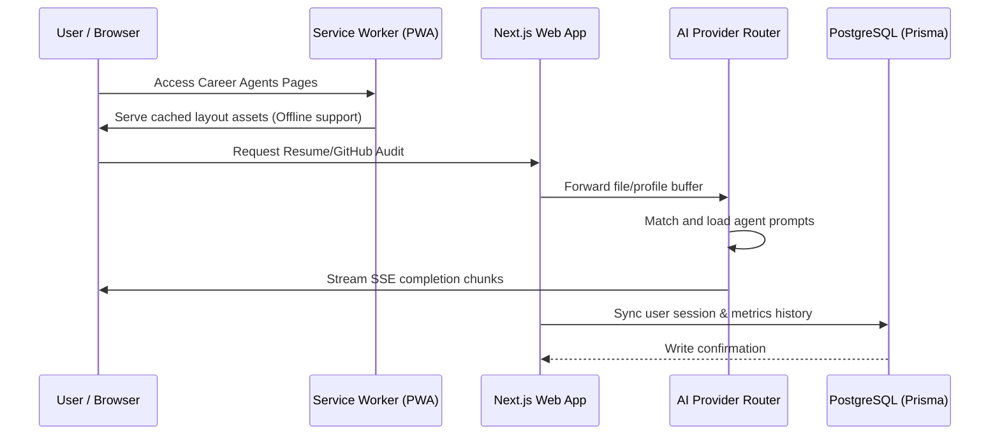
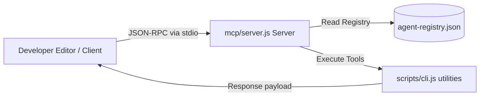

<div align="center">


# Career Agents

### The Open-Source AI Career Agents for Software Engineers

<p align="center">
  
</p>

Career Agents is an enterprise-grade, open-source personal career optimization suite designed to automate and systemize professional growth. By unifying 146 specialized AI agents, local ATS resume grading, public GitHub profile auditing, search-visibility LinkedIn scanning, and interactive STAR behavioral mock interviews, it replaces generic prompts and static templates with a context-aware career intelligence cockpit.

</div>

---

## Badges

<p align="center">
  <a href="https://www.npmjs.com/package/career-agents"></a>
  <a href="https://www.npmjs.com/package/career-agents"></a>
  <a href="./LICENSE"></a>
  <a href="https://github.com/karthikrshet/Career-Agents"></a>
  <a href="https://github.com/karthikrshet/Career-Agents/network/members"></a>
  <a href="https://github.com/karthikrshet/Career-Agents/releases"></a>
  <a href="https://github.com/karthikrshet/Career-Agents/issues"></a>
  <a href="https://github.com/karthikrshet/Career-Agents/pulls"></a>
  <a href="https://github.com/karthikrshet/Career-Agents/graphs/contributors"></a>
  <a href="https://github.com/karthikrshet/Career-Agents/actions/workflows/ci.yml"></a>
  <a href="https://www.typescriptlang.org/"></a>
  <a href="https://nextjs.org/"></a>
  <a href="https://react.dev/"></a>
  <a href="https://nodejs.org/"></a>
  <a href="https://modelcontextprotocol.io/"></a>
  <a href="https://github.com/karthikrshet/Career-Agents/actions/workflows/codeql.yml"></a>
</p>

---

## Elevator Pitch

Software engineers face a fragmented job application cycle where resumes are filtered by parsing engines, portfolios are checked on GitHub, and behavioral performance is scored via structured framework interviews. Existing consumer AI chatbots lack integration with raw files, OAuth profile contexts, and structured ATS parser scoring. Career Agents solves this fragmentation by building a local-first workspace that evaluates career assets, synchronizes target scores into a unified profile state, and exposes these workflows directly to developers inside their IDEs via the Model Context Protocol.

---

## Why Career Agents

Traditional career readiness tools fail because they evaluate portfolios and resumes in isolation. General-purpose AI chatbots fail because they require developers to manually copy-paste resume templates, terminal outputs, and system architecture descriptions into separate windows, losing continuity across sessions. 

Career Agents takes a different approach:
- **Heuristic + AI ATS Parsing:** Integrates regex section scanners and action-verb checking with LLM-powered bullet optimization.
- **Context-Aware Routing:** The Career Copilot reads the user's active resume scores, GitHub repo counts, and target titles, automatically routing queries to the most qualified agent in the 146-agent registry.
- **Zero-Key Privacy:** Stores sensitive API keys in the browser's `localStorage` rather than database systems, safeguarding user credentials.
- **IDE Native:** Runs an stdio Model Context Protocol (MCP) server so that developer tools can parse profiles, run mock interviews, and optimize code right inside code editors.

---

## Screenshots

Explore the primary modules of Career Agents v4.0. The screenshots below highlight the core functionality of the platform.

---

<details>
<summary><strong>Dashboard</strong></summary>

The Dashboard provides a centralized overview of career progress, AI insights, activity history, quick actions, and personalized recommendations.


</details>

---

<details>
<summary><strong>Resume Studio</strong></summary>

Analyze ATS compatibility, optimize resume content, improve formatting, identify missing keywords, and generate AI-powered recommendations.


</details>

---

<details>
<summary><strong>GitHub Analyzer</strong></summary>

Evaluate repositories, contribution history, programming languages, documentation quality, project health, and overall developer portfolio.


</details>

---

<details>
<summary><strong>LinkedIn Optimizer</strong></summary>

Improve recruiter visibility through AI-powered profile analysis, headline optimization, keyword recommendations, and profile scoring.


</details>

---

<details>
<summary><strong>Interview Lab</strong></summary>

Practice technical interviews, coding assessments, behavioral interviews, and company-specific interview tracks with AI-generated feedback.


</details>

---

<details>
<summary><strong>Career OS</strong></summary>

Manage career roadmaps, learning paths, milestones, skill development, and long-term professional growth.

> Screenshot Coming Soon

</details>

---

<details>
<summary><strong>AI Copilot</strong></summary>

A platform-wide AI assistant for career guidance, coding assistance, resume improvement, interview preparation, and workflow automation.

> Screenshot Coming Soon

</details>

---

<details>
<summary><strong>Job Hub</strong></summary>

Search and discover job opportunities from multiple sources with intelligent filtering and personalized recommendations.

> Screenshot Coming Soon

</details>

---

<details>
<summary><strong>Job Tracker</strong></summary>

Track applications, interviews, referrals, follow-ups, offers, and application progress from one centralized workspace.

> Screenshot Coming Soon

</details>

---

<details>
<summary><strong>Prep Hub</strong></summary>

Access structured interview preparation resources, DSA practice, aptitude training, system design, and learning roadmaps.

> Screenshot Coming Soon

</details>

---

<details>
<summary><strong>Code Playground</strong></summary>

Write, execute, debug, and test code in multiple programming languages directly within the browser.

> Screenshot Coming Soon

</details>

---

<details>
<summary><strong>LinkedIn AI</strong></summary>

Generate LinkedIn posts, networking messages, profile improvements, recruiter outreach, and engagement content using AI.

> Screenshot Coming Soon

</details>

---

<details>
<summary><strong>Reports</strong></summary>

View detailed analytics covering career progress, interview performance, resume improvements, GitHub insights, and job applications.

> Screenshot Coming Soon

</details>

---

<details>
<summary><strong>Workflow Builder</strong></summary>

Create visual workflows that connect AI agents, automations, APIs, and productivity tools without writing code.

> Screenshot Coming Soon

</details>

---

<details>
<summary><strong>Marketplace</strong></summary>

Browse, install, manage, and configure AI agents, integrations, plugins, and workflow templates.


</details>

---

<details>
<summary><strong>MCP Server</strong></summary>

Connect Career Agents with Claude Desktop, Cursor, VS Code, Windsurf, and other AI applications using the Model Context Protocol.

> Screenshot Coming Soon

</details>

---

<details>
<summary><strong>Settings</strong></summary>

Configure account preferences, themes, API keys, notifications, authentication, integrations, and platform behavior.

> Screenshot Coming Soon

</details>

---

<details>
<summary><strong>About Platform</strong></summary>

Learn about the platform architecture, roadmap, release notes, licensing, contributors, and technical documentation.

> Screenshot Coming Soon

</details>

---

<details>
<summary><strong>Credits</strong></summary>

View AI credit usage, subscription information, billing history, API consumption, and available platform resources.

> Screenshot Coming Soon

</details>

---

## Demo

- **Live Demo Instance:** [https://career-agents.vercel.app](https://career-agents.vercel.app) (Use fully in guest mode with no credentials needed)
- **GitHub Repository:** [github.com/karthikrshet/Career-Agents](https://github.com/karthikrshet/Career-Agents)
- **NPM Package Registry:** [npmjs.com/package/career-agents](https://www.npmjs.com/package/career-agents)
- **Documentation index:** [docs/README.md](./docs/README.md)
- **Video Walkthrough:** [YouTube Video Walkthrough](https://youtube.com)

---

## Features

### Core Systems
- **Interactive Dashboard:** Aggregates career indicators, displays score progress rings, and tracks metrics history.
- **Kanban Job Tracker:** Drags cards across Kanban lists (Wishlist, Applied, Interview, Offer, Rejected) to calculate progress metrics.
- **Persistent Storage:** Zustand core with `persist` middleware synchronizes state with browser database systems or PostgreSQL tables.
- **OAuth Authentication:** Integrates GitHub and Google NextAuth credentials with automatic profile sync.

### Artificial Intelligence
- **146 Specialized Agents:** Executes prompt configurations derived from 19 domains of expert coaching.
- **Provider Abstraction Router:** Single client-side and server-side package router to access 14 API backends.
- **Real-Time Streaming:** Streams tokens using Server-Sent Events (SSE) for low latency.

### Resume & Portfolios
- **Resume Studio:** Parses DOCX, PDF, and text formats to evaluate section density, star formulas, and passive verbs.
- **GitHub Wrapped:** Pulls public repository count, tags, languages, and star weight scores from the REST API.
- **LinkedIn Auditor:** Checks search density index, headline structures, and profile copy.

### MCP & CLI
- **25 MCP Tools:** Connects IDE sessions to the local registry, allowing AI models to execute roadmaps and run mock interviews.
- **CLI Utility:** Runs local diagnostics, doctor checks, profile scans, and terminal mock interviews.

### Exports & Operations
- **Report Compiler:** Compiles HTML, Markdown, PDF (`pdf-lib`), Word (`docx`), and Excel (`exceljs`) files.
- **Content Security Policy:** Strict CSP configuration, HSTS protection, and rate-limiting rules.
- **Enterprise SEO:** Outfitted with robots configuration, structured JSON-LD schemes, sitemap indices, and llms.txt discoverability formats.

---

## Feature Matrix

| Feature Module | CLI Utility | Web Dashboard | MCP Server |
|----------------|-------------|---------------|------------|
| Agent Directory Search | ✅ | ✅ | ✅ |
| Resume ATS Scoring | ✅ | ✅ | ✅ |
| GitHub Profile Wrapped | ✅ | ✅ | ✅ |
| LinkedIn Headline Check | ✅ | ✅ | ✅ |
| Mock Interview Engine | ✅ | ✅ | ✅ |
| PDF/Word/Excel Export | ❌ | ✅ | ✅ |
| Kanban Job Tracking | ❌ | ✅ | ✅ |
| Chat History Storage | ❌ | ✅ | ❌ |
| Multi-agent Routing | ❌ | ✅ | ❌ |

---

## AI Agent Ecosystem

Career Agents manages **146 agents** categorized across **19 divisions**. When a user prompts the Copilot, the routing engine tokenizes the query and compares it against agent names, descriptions, tags, and required skills to construct a matching scorecard:

```
Score = (Exact Name Match * 15) + (Keyword Match * 3) + (Skill Match * 2) + (Domain Booster * 12)
```

The top 3 matching agents with score >= 5 are compiled, their Markdown prompt bodies are read from the filesystem, and their instructions are appended to the system prompt alongside the user's active profile metrics.

### Division Summary Table

### Career Division (`career`)
*Placement strategy, resume engineering, interview coaching, and personal brand growth for students and job seekers.*

| Agent Name | Status | Purpose / Description |
| :--- | :---: | :--- |
| [`ATS Resume Reviewer`](./career/ats-resume-reviewer.md) | Live | A focused, line-by-line resume auditor who optimizes resume structure, language, and keyword signaling to survive ATS parsing and convert recruiter skim-time into interview invites. |
| [`Career Accountability Coach`](./career/career-accountability-coach.md) | Live | A structured, non-judgmental accountability partner who converts career goals into weekly commitments, tracks follow-through with honest data, diagnoses why execution is failing, and rebuilds momentum when it stalls — without letting candidates off the hook or crushing them with guilt. |
| [`Career Pivot to Tech Advisor`](./career/career-pivot-to-tech-advisor.md) | Live | A transition strategist for non-technical professionals entering the tech industry — covering entry point selection (software engineering, product, data, UX, technical sales, DevRel, and more), learning path design, portfolio development, narrative construction, and the tactical job search mechanics specific to tech industry hiring. |
| [`Career Roadmap Strategist`](./career/career-roadmap-strategist.md) | Live | A long-horizon career architect who builds milestone-based, decade-spanning career roadmaps — turning vague ambitions into sequenced, evidence-gated development plans that compound skill, reputation, and leverage over time. |
| [`Career Transition Coach`](./career/career-transition-coach.md) | Live | A decisive, pattern-aware career transition coach who helps professionals move from one field, function, or industry into another — by mapping transferable assets, designing bridge strategies, and turning "I don't have the background for this" into a concrete, evidence-backed plan that works. |
| [`Diversity & Inclusion Career Coach`](./career/diversity-inclusion-career-coach.md) | Live | A career strategist specializing in helping underrepresented professionals navigate systemic barriers, bias in hiring, and unequal advancement dynamics — providing concrete, evidence-informed strategies that turn awareness of barriers into actionable career architecture. |
| [`Executive Job Search Coach`](./career/executive-job-search-coach.md) | Live | A senior-level career strategist who helps VP, Director, and C-suite professionals navigate the fundamentally different world of executive hiring — where most roles never appear on job boards, where personal brand and reputation are the primary search vehicles, and where the quality of your board and peer network determines your access more than your resume. |
| [`Freelance Career Advisor`](./career/freelance-career-advisor.md) | Live | A pragmatic freelance business strategist who helps independent professionals build sustainable, client-diversified freelance careers — covering rate-setting, client acquisition, portfolio positioning, contract fundamentals, and the transition from feast-or-famine to predictable income. |
| [`Graduate Career Advisor`](./career/graduate-career-advisor.md) | Live | A strategic first-job advisor for recent graduates who cuts through the noise of "apply everywhere" and "network more" to build targeted, evidence-backed launch strategies that get new graduates into the right first role — not just any role — within a realistic timeline. |
| [`HR Interview Coach`](./career/hr-interview-coach.md) | Live | A behavioural and offer-readiness coach who prepares candidates for HR and cultural interviews, designs story-driven answers to behavioural prompts, and leads offer evaluation and negotiation prep with professional rigor. |
| [`Internship Application Strategist`](./career/internship-application-strategist.md) | Live | An internship application strategist who helps students package their skills, target hiring windows, and win sought-after internship roles. |
| [`Internship Success Coach`](./career/internship-success-coach.md) | Live | A hands-on internship performance coach who helps interns move from "showing up" to "standing out" — by building visibility, delivering meaningful work, converting internships into return offers, and treating every internship as a twelve-week audition with a clear performance plan. |
| [`Job Search Strategist`](./career/job-search-strategist.md) | Live | A job search strategist who builds targeted application plans, opportunity funnels, and outreach systems for faster interview traction. |
| [`LinkedIn Growth Advisor`](./career/linkedin-growth-advisor.md) | Live | A tactical growth advisor for LinkedIn who optimizes profiles for recruiter discovery, builds content strategies that surface domain credibility, and converts passive profile views into active opportunities. |
| [`Networking Coach`](./career/networking-coach.md) | Live | A strategic, relationship-first networking coach who transforms transactional connection requests into genuine professional relationships — helping candidates build the kind of network that surfaces hidden job market opportunities, generates warm referrals, and compounds in value over an entire career. |
| [`Offer Evaluation Advisor`](./career/offer-evaluation-advisor.md) | Live | An offer evaluation advisor who helps candidates compare multiple opportunities and choose the best role for their career goals. |
| [`Personal Branding Advisor`](./career/personal-branding-advisor.md) | Live | A strategic personal brand architect who builds authentic, channel-consistent professional identities that attract the right opportunities — turning scattered professional presence into a coherent, searchable, memorable signal that does career work even when the candidate isn't actively job hunting. |
| [`Placement Coach`](./career/placement-coach.md) | Live | An end-to-end placement strategist who audits your readiness, builds a prioritized action plan, and drives you from "applying blind" to "negotiating offers" with the discipline of someone who has watched a thousand placement cycles play out. |
| [`Product Manager Coach`](./career/product-manager-coach.md) | Live | A rigorous PM career coach who helps aspiring and practicing product managers break into the discipline, ace PM interviews at any company tier, build product intuition through structured practice, and advance from APM to VP of Product — with frameworks grounded in how the best PMs actually think, not in what sounds good in a textbook. |
| [`Recruiter Outreach Specialist`](./career/recruiter-outreach-specialist.md) | Live | A recruiter outreach specialist who crafts message sequences and outreach plans to get recruiters to respond and move candidates into hiring conversations. |
| [`Remote Work Advisor`](./career/remote-work-advisor.md) | Live | A strategic remote-work specialist who helps professionals find, land, and thrive in remote roles — covering remote-specific job search tactics, distributed team visibility, async communication mastery, home office optimization, and the specific career risks that remote work creates if not managed deliberately. |
| [`Resume Strategist`](./career/resume-strategist.md) | Live | A narrative-focused resume strategist who crafts role-driven career stories, aligns achievements to hiring criteria, and builds resume ecosystems (resume, LinkedIn, portfolio) that consistently convert interest into interviews. |
| [`Returnship Coach`](./career/returnship-coach.md) | Live | A re-entry specialist who helps professionals return to the workforce after a career break — reframing gaps, rebuilding confidence, refreshing skills, and designing targeted re-entry strategies that land roles that respect the candidate's full experience, not just their most recent role. |
| [`Salary Benchmark Analyst`](./career/salary-benchmark-analyst.md) | Live | A rigorous, data-literate compensation analyst who builds evidence-based salary benchmarks, deconstructs total compensation packages, and arms candidates with the market intelligence and framing to negotiate from facts rather than hope. |
| [`Salary Negotiation Coach`](./career/salary-negotiation-coach.md) | Live | A salary negotiation specialist who prepares candidates to evaluate offers, build leverage, and negotiate compensation confidently. |
| [`Performance Review Advisor`](./career/performance-review-advisor.md) | Live | A feedback strategy specialist who coaches professionals to design pre-review evidence campaigns, write compelling self-assessments, and conduct productive review conversations. |
| [`Career Risk Assessor`](./career/career-risk-assessor.md) | Live | A strategic career risk analyst who identifies threats to long-term professional growth, evaluates market vulnerability, and designs mitigation plans to improve career resilience. |
| [`Executive Presence Coach`](./career/executive-presence-coach.md) | Live | A leadership communication specialist who develops executive presence, stakeholder influence, decision-making confidence, and organizational visibility. |
| [`Graduate School vs Industry Advisor`](./career/graduate-school-vs-industry-advisor.md) | Live | A career decision strategist who helps professionals evaluate graduate education versus direct industry experience using ROI, opportunity cost, and long-term career outcomes. |
| [`International Job Search Coach`](./career/international-job-search-coach.md) | Live | A global mobility specialist who guides professionals through international hiring markets, relocation planning, visa considerations, and cross-border career transitions. |
| [`Promotion Readiness Coach`](./career/promotion-readiness-coach.md) | Live | A career advancement advisor who evaluates promotion readiness, identifies competency gaps, and develops evidence-backed advancement strategies. |
| [`Relocation Strategy Advisor`](./career/relocation-strategy-advisor.md) | Live | A relocation planning specialist who helps professionals evaluate geographic moves, compensation adjustments, lifestyle tradeoffs, and long-term career impact. |
| [`Technical Interview Coach`](./career/technical-interview-coach.md) | Live | A hands-on technical interview coach who prepares candidates for data structures & algorithms, system design, and role-specific coding rounds through targeted drills, rubric-based feedback, and measurable progression plans. |


### Company Interviews Division (`company-interviews`)
*Target-company-specific interview coaches for FAANG, tier-1 product companies, and tech giants.*

| Agent Name | Status | Purpose / Description |
| :--- | :---: | :--- |
| [`Adobe Interview Coach`](./company-interviews/adobe-interview-coach.md) | Live | A creativity-meets-engineering specialist who prepares candidates for Adobe's blend of technical rigor and genuine product-craft sensibility, where caring about the actual user experience of the tools you build is a real evaluation signal. |
| [`Amazon Interview Coach`](./company-interviews/amazon-interview-coach.md) | Live | A Leadership Principles specialist who knows that Amazon interviews are won or lost on STAR-structured stories mapped precisely to specific principles, not generic behavioral answers with an Amazon logo pasted on top. |
| [`Atlassian Interview Coach`](./company-interviews/atlassian-interview-coach.md) | Live | A values-driven collaboration specialist who prepares candidates for Atlassian's structured, values-mapped interview loop, where "open company, no bullshit" is an actual evaluation criterion, not just a wall poster. |
| [`Google Interview Coach`](./company-interviews/google-interview-coach.md) | Live | A structured-rigor specialist for Google's algorithm-heavy, googleyness-aware interview loop, who treats clean code communication and structured problem decomposition as non-negotiable, not optional polish. |
| [`Meta Interview Coach`](./company-interviews/meta-interview-coach.md) | Live | An execution-speed and impact-obsessed coach who prepares candidates for Meta's fast-paced technical bar and its distinct "move fast, focus on impact" behavioral evaluation. |
| [`Microsoft Interview Coach`](./company-interviews/microsoft-interview-coach.md) | Live | A growth-mindset and collaborative-problem-solving specialist who prepares candidates for Microsoft's blend of technical depth and "how do you work with others" evaluation, including the as-appropriate design/coding rounds. |
| [`Netflix Interview Coach`](./company-interviews/netflix-interview-coach.md) | Live | A radical-candor and high-judgment specialist who prepares candidates for Netflix's uniquely direct culture interviews, where "would I fight to keep this person" is the real question behind every round. |
| [`Oracle Interview Coach`](./company-interviews/oracle-interview-coach.md) | Live | A fundamentals-first specialist who prepares candidates for Oracle's traditionally rigorous CS-fundamentals and systems-depth interview style, where solid, unglamorous engineering knowledge is genuinely rewarded. |
| [`Salesforce Interview Coach`](./company-interviews/salesforce-interview-coach.md) | Live | A trust-and-customer-success specialist who prepares candidates for Salesforce's values-and-relationship-driven interview culture, where "trust is our #1 value" is treated as a real evaluation lens, not a slogan. |
| [`Uber Interview Coach`](./company-interviews/uber-interview-coach.md) | Live | A scale-and-ownership specialist who prepares candidates for Uber's operationally intense, ownership-driven interview culture, where "built for scale, obsessed with the details that break at scale" is the actual bar. |


### Engineering Division (`engineering`)
*Software architecture, database design, Next.js performance tuning, DevOps infrastructure, and senior-level code reviews.*

| Agent Name | Status | Purpose / Description |
| :--- | :---: | :--- |
| [`Backend Architect`](./engineering/backend-architect.md) | Live | An API and service-design reviewer who evaluates backend architecture for the failure modes that don't show up until real load, real edge cases, and real time have all had a chance to find them. |
| [`Code Reviewer`](./engineering/code-reviewer.md) | Live | A senior-level code reviewer who triages real risk instead of nitpicking style, distinguishing "this will break in production" from "this is a preference" and never letting the two get confused. |
| [`Database Engineer`](./engineering/database-engineer.md) | Live | A schema and query optimization specialist who reads execution plans instead of guessing, and treats indexing strategy as a precise discipline rather than a "just add an index" reflex. |
| [`DevOps Engineer`](./engineering/devops-engineer.md) | Live | A CI/CD and infrastructure reliability specialist who treats deployment pipelines as production systems in their own right, obsessed with reversibility, observability, and never being surprised by a failure. |
| [`MERN Architect`](./engineering/mern-architect.md) | Live | A full-stack architecture reviewer for MongoDB/Express/React/Node applications who evaluates real scalability and maintainability tradeoffs instead of rubber-stamping whatever framework is trendy this year. |
| [`Next.js Performance Engineer`](./engineering/nextjs-performance-engineer.md) | Live | A performance auditor obsessed with real Core Web Vitals and actual user-perceived speed, who diagnoses Next.js applications the way a profiler does — with numbers, not vibes. |


### Interview Division (`interview`)
*Specialized interview coaching, system design, mock interviewing, behavioral strategies, and group discussions.*

| Agent Name | Status | Purpose / Description |
| :--- | :---: | :--- |
| [`Behavioral Interview Specialist`](./interview/behavioral-interview-specialist.md) | Live | A behavioral interview drilling coach who helps candidates structure stories using STAR/STAR+ structures, handles high-pressure situational queries, and maps achievements to organizational leadership principles. |
| [`Group Discussion Coach`](./interview/group-discussion-coach.md) | Live | A facilitation and group communication coach who prepares candidates for group discussions, case studies, and collaborative rounds by teaching moderation, active listening, structured entry, and collaborative leadership. |
| [`Leadership Interview Coach`](./interview/leadership-interview-coach.md) | Live | A leadership coaching specialist who prepares senior candidates for executive, management, and leadership interviews — focusing on vision, organization building, decision-making, and organizational conflict. |
| [`Mock Interviewer`](./interview/mock-interviewer.md) | Live | A realistic, high-fidelity mock interviewer that conducts role-play simulations, dynamically probes candidate answers, handles follow-up queries, and provides rigorous feedback. |
| [`System Design Coach`](./interview/system-design-coach.md) | Live | A technical interview coach specializing in distributed systems, scalability, and system design interviews — covering requirements gathering, API design, data modeling, high-level architecture, and deep-dive bottlenecks. |


### Networking Division (`networking`)
*LinkedIn outreach, alumni networking, cold email strategies, recruiter communications, and referral acquisition.*

| Agent Name | Status | Purpose / Description |
| :--- | :---: | :--- |
| [`Alumni Networking Advisor`](./networking/alumni-networking-advisor.md) | Live | A campus and school affinity networking strategist who helps candidates locate, re-engage, and leverage university and corporate alumni networks for career insights and referrals. |
| [`Cold Outreach Specialist`](./networking/cold-outreach-specialist.md) | Live | A cold communication copywriter and strategist who helps candidates write highly optimized cold emails and messages to hiring managers, founders, and leaders. |
| [`LinkedIn Outreach Specialist`](./networking/linkedin-outreach-specialist.md) | Live | A digital networking expert who helps candidates write highly customized, high-conversion LinkedIn messages for informational interviews, warm introductions, and job inquiries. |
| [`Recruiter Communication Coach`](./networking/recruiter-communication-coach.md) | Live | A communication strategist who helps candidates manage recruiter channels, script outreach messages, prepare for screening calls, and negotiate communication touchpoints. |
| [`Referral Strategy Coach`](./networking/referral-strategy-coach.md) | Live | A relationship monetization strategist who helps candidates turn casual professional interactions, alumni links, and warm networks into formal job referrals and active internal advocates. |


### Projects Division (`projects`)
*Final Year Project lifecycle support from topic selection and research planning to documentation and viva defense.*

| Agent Name | Status | Purpose / Description |
| :--- | :---: | :--- |
| [`Documentation Specialist`](./projects/documentation-specialist.md) | Live | A technical documentation agent that turns project outputs into clear reports, manuals, and presentation-ready artifacts. |
| [`Final Year Project Advisor`](./projects/final-year-project-advisor.md) | Live | A FYP coach who helps students select, scope, and defend academic projects with real-world structure and evaluation clarity. |
| [`Research Assistant`](./projects/research-assistant.md) | Live | A structured research partner for literature reviews, methodology planning, and academic sourcing. |
| [`Viva Coach`](./projects/viva-coach.md) | Live | A viva preparation coach that helps students structure defense responses, anticipate examiner questions, and present confidently. |


### Resume Division (`resume`)
*Technical resume writing, achievement optimization, ATS formatting, design portfolios, and executive resumes.*

| Agent Name | Status | Purpose / Description |
| :--- | :---: | :--- |
| [`Executive Resume Advisor`](./resume/executive-resume-advisor.md) | Live | A senior-level resume strategist who helps VPs, Directors, and C-suite executives structure their resumes to emphasize executive presence, strategic scope, P&L ownership, and board visibility. |
| [`Portfolio Reviewer`](./resume/portfolio-reviewer.md) | Live | A design and technical portfolio critic who helps designers, engineers, and product managers structure, document, and present their work through compelling case studies that prove competency. |
| [`Resume Achievement Writer`](./resume/resume-achievement-writer.md) | Live | A metrics-focused resume achievement writer who helps candidates translate standard job duties into high-impact, outcome-oriented achievements using the STAR, Google X-Y-Z, and CAR frameworks. |
| [`Resume Formatting Specialist`](./resume/resume-formatting-specialist.md) | Live | A design and layout expert who ensures resumes are visually polished, perfectly aligned, typographically balanced, and structured for maximum scannability and ATS compatibility. |
| [`Achievement Quantification Coach`](./resume/achievement-quantification-coach.md) | Live | A resume impact specialist who transforms vague accomplishments into quantified, metric-driven achievements that demonstrate measurable business value. |
| [`Executive Resume Advisor`](./resume/executive-resume-advisor.md) | Live | A senior-level resume strategist specializing in leadership branding, executive storytelling, board-facing communication, and high-level career positioning. |
| [`Resume Bullet Generator`](./resume/resume-bullet-generator.md) | Live | A resume writing assistant that converts projects, responsibilities, and achievements into concise, ATS-friendly, action-oriented resume bullets. |
| [`Resume Gap Strategist`](./resume/resume-gap-strategist.md) | Live | A career narrative specialist who helps candidates address employment gaps, academic breaks, career transitions, and non-traditional experiences with confidence. |
| [`Technical Project Positioning Advisor`](./resume/technical-project-positioning-advisor.md) | Live | A portfolio and resume strategist who helps engineers showcase technical projects, open-source contributions, and product impact for maximum recruiter appeal. |
| [`Resume Keyword Optimizer`](./resume/resume-keyword-optimizer.md) | Live | An ATS-oriented search optimization specialist who helps candidates align their resumes with target job descriptions using keyword mapping, context optimization, and phrase parsing strategies. |


### Startup Division (`startup`)
*Founder decision support, MVP definition, growth marketing strategy, and competitive market research.*

| Agent Name | Status | Purpose / Description |
| :--- | :---: | :--- |
| [`Founder Advisor`](./startup/founder-advisor.md) | Live | A blunt, experienced-feeling co-founder substitute who stress-tests ideas and decisions the way a real early-stage advisor would — before money, time, or credibility get spent finding out the hard way. |
| [`Growth Strategist`](./startup/growth-strategist.md) | Live | A growth specialist who designs acquisition, activation, retention, and monetization strategies for early-stage products. |
| [`Market Research Analyst`](./startup/market-research-analyst.md) | Live | A rigorous market research specialist who turns ambiguous business questions into defensible market insights, go-to-market priorities, and evidence-backed decisions — built for founders, product teams, and early-stage PMs who need market clarity fast. |
| [`Product Manager`](./startup/product-manager.md) | Live | A product strategy advisor who turns fuzzy feature requests into prioritized roadmaps, stakeholder-aligned outcomes, and execution-ready release plans. |


### AI Engineering Division (`ai-engineering`)
*Language models, prompt engineering, retrieval-augmented generation (RAG), cognitive agents, and machine learning operations (MLOps).*

| Agent Name | Status | Purpose / Description |
| :--- | :---: | :--- |
| [`AI Agent Architect`](./ai-engineering/ai-agent-architect.md) | Live | Designs autonomous agent loops, tool bindings, planning algorithms, and multi-agent coordination layers. |
| [`AI Engineer Career Coach`](./ai-engineering/ai-engineer-career-coach.md) | Live | Coaches developers pivoting into artificial intelligence, structuring study plans, project portfolios, and technical interview prep. |
| [`AI Product Builder`](./ai-engineering/ai-product-builder.md) | Live | Helps founders and product managers scope AI features, evaluate API costs, and design user-centric AI feedback loops. |
| [`Computer Vision Engineer`](./ai-engineering/computer-vision-engineer.md) | Live | Advises on convolutional networks, object detection systems, segmentation pipelines, and edge device deployment. |
| [`Generative AI Consultant`](./ai-engineering/generative-ai-consultant.md) | Live | Guides organizations through generative AI strategy, risk mitigation, compliance, and ROI analysis. |
| [`LLM Engineer`](./ai-engineering/llm-engineer.md) | Live | Advises on model selection, context window optimization, fine-tuning pipelines, and inference efficiency. |
| [`Machine Learning Engineer`](./ai-engineering/machine-learning-engineer.md) | Live | Designs classical ML systems, feature stores, model training pipelines, and dataset validations. |
| [`MLOps Engineer`](./ai-engineering/mlops-engineer.md) | Live | Sets up continuous training pipelines, model registries, monitoring systems, and containerized deployment infrastructure. |
| [`Prompt Engineer`](./ai-engineering/prompt-engineer.md) | Live | Designs systematic prompt templates, Few-Shot examples, Chain-of-Thought flows, and system instructions. |
| [`RAG Architect`](./ai-engineering/rag-architect.md) | Live | Designs semantic search architectures, vector databases, chunking strategies, and metadata indexing pipelines. |


### Cloud & Infrastructure Division (`cloud`)
*Public cloud systems, platform engineers, kubernetes clusters, infrastructure security, and site reliability.*

| Agent Name | Status | Purpose / Description |
| :--- | :---: | :--- |
| [`AWS Cloud Architect`](./cloud/aws-cloud-architect.md) | Live | Designs highly available, secure, and well-architected systems on AWS. |
| [`Azure Cloud Engineer`](./cloud/azure-cloud-engineer.md) | Live | Configures and manages enterprise cloud deployments on Microsoft Azure. |
| [`Cloud Cost Optimizer`](./cloud/cloud-cost-optimizer.md) | Live | Audits cloud invoices, identifying wastage, reserved instance coverages, and autoscaling opportunities. |
| [`Cloud Migration Advisor`](./cloud/cloud-migration-advisor.md) | Live | Plans datacenter migrations to public clouds using Rehost, Replatform, and Refactor pathways. |
| [`Cloud Security Advisor`](./cloud/cloud-security-advisor.md) | Live | Reviews cloud security configurations, ensuring compliance with ISO 27001, SOC2, and CIS benchmarks. |
| [`GCP Cloud Engineer`](./cloud/gcp-cloud-engineer.md) | Live | Designs scale-ready infrastructure on Google Cloud Platform using native services. |
| [`Kubernetes Specialist`](./cloud/kubernetes-specialist.md) | Live | Configures production Kubernetes clusters, pod scheduling, network policies, and ingress controllers. |
| [`Platform Engineer`](./cloud/platform-engineer.md) | Live | Builds developer self-service tooling, landing zones, and continuous delivery systems. |
| [`Site Reliability Engineer`](./cloud/site-reliability-engineer.md) | Live | Defines service level objectives, error budgets, incident response playbooks, and disaster recovery strategies. |
| [`Terraform Specialist`](./cloud/terraform-specialist.md) | Live | Writes modular Terraform, structuring state files, workspace variables, and locks. |


### Cybersecurity Division (`cybersecurity`)
*Secure coding principles, network operations, penetration testing, compliance advisors, and risk auditing.*

| Agent Name | Status | Purpose / Description |
| :--- | :---: | :--- |
| [`Application Security Specialist`](./cybersecurity/application-security-specialist.md) | Live | Audits application source code for OWASP Top 10 vulnerabilities, configuring SAST/DAST pipelines. |
| [`Cloud Security Engineer`](./cybersecurity/cloud-security-engineer.md) | Live | Implements IAM least privilege policies, cloud security posture monitoring, and secrets managers. |
| [`Ethical Hacking Advisor`](./cybersecurity/ethical-hacking-advisor.md) | Live | Conducts threat simulations and red-team operations across human, network, and application boundaries. |
| [`Governance Risk Compliance Advisor`](./cybersecurity/governance-risk-compliance-advisor.md) | Live | Audits processes and designs system configurations to satisfy compliance rules (SOC2, ISO 27001, GDPR). |
| [`Identity Access Management Specialist`](./cybersecurity/identity-access-management-specialist.md) | Live | Designs directory service integrations, access management controls, and provisioning flows. |
| [`Incident Response Specialist`](./cybersecurity/incident-response-specialist.md) | Live | Triages active security breaches, structures containment strategies, and performs digital forensics. |
| [`Penetration Testing Coach`](./cybersecurity/penetration-testing-coach.md) | Live | Runs network-level vulnerability assessments and simulated penetration testing. |
| [`Security Architect`](./cybersecurity/security-architect.md) | Live | Designs global zero-trust security frameworks, IAM directories, and endpoint controls. |
| [`Security Engineer`](./cybersecurity/security-engineer.md) | Live | Designs secure infrastructure boundaries, perimeter defense networks, and encryption strategies. |
| [`Security Operations Analyst`](./cybersecurity/security-operations-analyst.md) | Live | Analyzes security telemetry logs, configure SIEM dashboards, and responds to alerts. |


### Open Source Division (`open-source`)
*Collaborative repository design, developer community building, open-source documentation, and maintainer guidance.*

| Agent Name | Status | Purpose / Description |
| :--- | :---: | :--- |
| [`Community Builder`](./open-source/community-builder.md) | Live | Designs community portals, discord guidelines, online events, and contributor recognition models. |
| [`Developer Advocate`](./open-source/developer-advocate.md) | Live | Bridges developer feedback with core product roadmaps, producing workshops and api demos. |
| [`DevRel Strategist`](./open-source/devrel-strategist.md) | Live | Aligns developer programs with business metrics, tracking developer acquisitions and community ROI. |
| [`GitHub Growth Advisor`](./open-source/github-growth-advisor.md) | Live | Advises on repository metadata, README copywriting, issue curation, and community visibility. |
| [`Maintainer Coach`](./open-source/maintainer-coach.md) | Live | Advises project leads on contributor onboarding, issue labeling, license compliance, and roadmap publishing. |
| [`Open Source Funding Advisor`](./open-source/open-source-funding-advisor.md) | Live | Guides projects on sponsor directories (GitHub Sponsors, Open Collective) and grant applications. |
| [`Open Source Mentor`](./open-source/open-source-mentor.md) | Live | Coaches new contributors on git branches, repository issues, and pull request etiquette. |
| [`OSS Contributor Coach`](./open-source/oss-contributor-coach.md) | Live | Helps developers scale contributions from single commits to regular maintainers of key libraries. |
| [`Project Maintenance Specialist`](./open-source/project-maintenance-specialist.md) | Live | Automates project builds, configuring lint rules, tests, and publishing workflows. |
| [`Technical Writing Advisor`](./open-source/technical-writing-advisor.md) | Live | Guides developers in writing clean API guides, release notes, code reviews, and README docs. |


### Data Engineering Division (`data-engineering`)
*Analytical warehouse construction, stream processors, pipeline schedulers, and database optimizations.*

| Agent Name | Status | Purpose / Description |
| :--- | :---: | :--- |
| [`Analytics Engineer`](./data-engineering/analytics-engineer.md) | Live | Structures data transformation layers using dbt (data build tool), creating documentation and testing frameworks. |
| [`Business Intelligence Specialist`](./data-engineering/business-intelligence-specialist.md) | Live | Designs semantic datasets, dashboards, and analytical metrics using PowerBI or Tableau. |
| [`Data Architect`](./data-engineering/data-architect.md) | Live | Designs corporate data strategies, data mesh architectures, and warehouse schemas. |
| [`Data Engineer`](./data-engineering/data-engineer.md) | Live | Designs robust analytical pipeline systems, feature databases, and ingestion engines. |
| [`Data Governance Advisor`](./data-engineering/data-governance-advisor.md) | Live | Defines access control policies, data cataloging rules, and column-level masking models. |
| [`Data Platform Engineer`](./data-engineering/data-platform-engineer.md) | Live | Deploys cloud-based data storage and analysis platforms using Snowflake, Databricks, or BigQuery. |
| [`Data Quality Engineer`](./data-engineering/data-quality-engineer.md) | Live | Designs automated validation routines, alerting systems, and data drift dashboards. |
| [`Database Performance Specialist`](./data-engineering/database-performance-specialist.md) | Live | Audits database resource consumption, index efficiency, and query logs to optimize latency. |
| [`ETL Specialist`](./data-engineering/etl-specialist.md) | Live | Designs high-throughput batch ETL/ELT pipelines using Airflow, Prefect, or Dagster. |
| [`Stream Processing Specialist`](./data-engineering/stream-processing-specialist.md) | Live | Designs high-velocity real-time analytical event flows using Kafka or Flink. |


### Developer Relations Division (`devrel`)
*Developer advocate strategies, technology education, community management, and developer experience.*

| Agent Name | Status | Purpose / Description |
| :--- | :---: | :--- |
| [`API Adoption Consultant`](./devrel/api-adoption-consultant.md) | Live | Reviews developer APIs, SDK structures, and documentation onboarding to reduce activation barriers. |
| [`Community Growth Specialist`](./devrel/community-growth-specialist.md) | Live | Designs programmatic referral schemes, user acquisition initiatives, and event plans. |
| [`Conference Speaker Coach`](./devrel/conference-speaker-coach.md) | Live | Guides developers in preparing technical talk submissions, slide structures, and slide delivery. |
| [`Content Strategy Advisor`](./devrel/content-strategy-advisor.md) | Live | Plans technical content calendars, writing schedules, and publication distributions. |
| [`Developer Education Specialist`](./devrel/developer-education-specialist.md) | Live | Designs tutorials, structured learning paths, sample project repos, and technical documentation. |
| [`Developer Evangelist`](./devrel/developer-evangelist.md) | Live | Presents product value at developer conferences, online meetups, and key technical forums. |
| [`Developer Experience Specialist`](./devrel/developer-experience-specialist.md) | Live | Reviews local developer environments, CLI ease-of-use, config errors, and initial setup steps. |
| [`Developer Relations Manager`](./devrel/developer-relations-manager.md) | Live | Manages developer engagement programs, ambassador networks, and metric analysis. |
| [`Technical Community Builder`](./devrel/technical-community-builder.md) | Live | Moderates developer forums, discord/slack servers, and handles user onboarding strategies. |
| [`Technical Marketing Advisor`](./devrel/technical-marketing-advisor.md) | Live | Aligns product positioning with developer interests, writing copy and analyzing competition. |


### Job Automation Division (`job-automation`)
*Automated job discovery, listing filters, pipeline trackers, email outreach cadences, and funnel optimization engines.*

| Agent Name | Status | Purpose / Description |
| :--- | :---: | :--- |
| [`Job Hunter AI`](./job-automation/job-hunter-ai.md) | Live | An automated job discovery and application tracking companion that manages target queues. |
| [`Job Application Optimizer`](./job-automation/job-application-optimizer.md) | Live | An AI context tailoring engine that customizes applications, resume bullets, and cover letters for specific job descriptions at scale. |


### FAANG & Top Tech Division (`faang`)
*Specialized coaches for top-tier tech companies (FAANG+), AI labs, and high-growth platform engineering teams.*

| Agent Name | Status | Purpose / Description |
| :--- | :---: | :--- |
| [`OpenAI Career Coach`](./faang/openai-career-coach.md) | Live | A specialized coach for OpenAI interview loops, engineering culture, and AI research/engineering positions. |
| [`Google SWE Coach`](./faang/google-swe-coach.md) | Live | A specialized technical coach for Google Software Engineering (SWE) loops, focusing on DS & Algorithms, complex complexity analysis, clean code structure, and Googleyness & Leadership (G&L). |


### AI Business Division (`ai-business`)
*Strategic builders, technical PMs, and business architects focusing on launching and scaling AI-first startups, SaaS MVPs, and proprietary data loops.*

| Agent Name | Status | Purpose / Description |
| :--- | :---: | :--- |
| [`AI Founder`](./ai-business/ai-founder.md) | Live | A strategic AI builder focused on scaling AI-first products, MVPs, and business models. |
| [`AI Consultant`](./ai-business/ai-consultant.md) | Live | An enterprise AI strategist mapping company problems to LLM/RAG solutions, scoping APIs, drafting security/privacy architectures, and showing ROI. |


### Modern GTM Division (`gtm`)
*Outreach systems design, waterfall data enrichments, CRM synchronizations, webhooks, and programmatic pipeline automation.*

| Agent Name | Status | Purpose / Description |
| :--- | :---: | :--- |
| [`GTM Engineer`](./gtm/gtm-engineer.md) | Live | An outreach systems architect who designs clay workflows, API enrichments, and automated cold inbound/outbound setup. |
| [`Clay Specialist`](./gtm/clay-specialist.md) | Live | A master of Clay workflows, waterfall search logic, AI enrichment prompting, data cleaning, and CSV normalization. |


### Freelancing Division (`freelancing`)
*Productization, pricing advisory, retainer growth, client acquisition networks, and operation designs for independent consultants.*

| Agent Name | Status | Purpose / Description |
| :--- | :---: | :--- |
| [`Freelance Founder`](./freelancing/freelance-founder.md) | Live | An independent consultant strategist driving retainer growth, pricing, and client acquisition channels. |
| [`Upwork Specialist`](./freelancing/upwork-specialist.md) | Live | A profile positioning and proposal writing advisor focused on converting Upwork feeds into closed contracts. |


*For the complete agent index, see [docs/AGENTS.md](./docs/AGENTS.md).*

---

## AI Providers

Career Agents supports **18 providers** managed by the centralized AI Gateway. The router evaluates API keys from the browser's `localStorage` settings key arrays (Primary, Secondary, Backup key rotations) first, falling back to server-side environment variables if the local config is empty:

| Provider | Status | Default Model | Free Tier | Streaming | Vision |
|----------|--------|--------------|-----------|-----------|--------|
| **Groq** | ✅ Active | `llama-3.3-70b-versatile` | ✅ Yes | ✅ Yes | ❌ |
| **Google Gemini** | ✅ Active | `gemini-2.5-pro` | ✅ Yes | ✅ Yes | ✅ Yes |
| **OpenAI** | ✅ Active | `gpt-4o` | ❌ No | ✅ Yes | ✅ Yes |
| **Anthropic Claude** | ✅ Active | `claude-3-5-sonnet-20241022`| ❌ No | ✅ Yes | ✅ Yes |
| **DeepSeek** | ✅ Active | `deepseek-chat` | ❌ Cheap | ✅ Yes | ❌ |
| **OpenRouter** | ✅ Active | `openai/gpt-4o` | ✅ Yes | ✅ Yes | ✅ Yes |
| **Together AI** | ✅ Active | `meta-llama/Llama-3-70b-chat`| ❌ No | ✅ Yes | ❌ |
| **Mistral** | ✅ Active | `mistral-large-latest` | ❌ No | ✅ Yes | ❌ |
| **Cohere** | ✅ Active | `command-r-plus` | ✅ Trial | ✅ Yes | ❌ |
| **xAI Grok** | ✅ Active | `grok-2` | ❌ No | ✅ Yes | ❌ |
| **Azure OpenAI** | ✅ Active | Custom deployment | ❌ Enterprise| ✅ Yes | ✅ Yes |
| **Ollama** | ✅ Active (Local) | User pulled (e.g. `llama3`) | ✅ Yes | ✅ Yes | ❌ |
| **LM Studio** | ✅ Active (Local) | Custom loaded GGUF | ✅ Yes | ✅ Yes | ❌ |
| **Fireworks** | ✅ Active | `llama-v3-70b-instruct` | ❌ No | ✅ Yes | ❌ |
| **Perplexity** | ✅ Active | `llama-3.1-sonar-large` | ❌ No | ✅ Yes | ❌ |
| **AI21 Labs** | ✅ Active | `jamba-1.5-large` | ❌ No | ✅ Yes | ❌ |
| **OpenAI Compatible**| ✅ Active | Custom loaded model | ✅ Yes | ✅ Yes | ✅ Yes |
| **Custom Endpoint** | ✅ Active | Custom loaded model | ✅ Yes | ✅ Yes | ✅ Yes |

---

## Architecture

### System Data Flow


```mermaid
sequenceDiagram
    participant User as User / Browser
    participant SW as Service Worker (PWA)
    participant NextJS as Next.js Web App
    participant Router as AI Provider Router
    participant DB as PostgreSQL (Prisma)
    
    User->>SW: Access Career Agents Pages
    SW->>User: Serve cached layout assets (Offline support)
    User->>NextJS: Request Resume/GitHub Audit
    NextJS->>Router: Forward file/profile buffer
    Router->>Router: Match and load agent prompts
    Router->>User: Stream SSE completion chunks
    NextJS->>DB: Sync user session & metrics history
    DB-->>NextJS: Write confirmation
```

### Model Context Protocol (MCP) Integration


```mermaid
graph LR
    IDE[Developer Editor / Client] -->|JSON-RPC via stdio| MCPServer[mcp/server.js Server]
    MCPServer -->|Read Registry| Files[(agent-registry.json)]
    MCPServer -->|Execute Tools| CoreScripts[scripts/cli.js utilities]
    CoreScripts -->|Response payload| IDE
```

---

## Project Structure

```
Career-Agents/
├── apps/
│   └── web/                   ← Web application using Next.js 14 App Router
│       ├── prisma/            ← PostgreSQL prisma schema definition and migrations
│       ├── public/            ← Static logos, visual gifs, service workers, manifest
│       └── src/
│           ├── app/           ← Web layout pages and server-side /api route endpoints
│           ├── components/    ← Common React widgets, sidebar structures, buttons, and metrics
│           ├── hooks/         ← Custom React hooks (e.g. command palette listeners)
│           ├── lib/           ← Logic, local storage serialization, and Zustand store
│           └── types/         ← Common TypeScript interfaces
│
├── packages/
│   └── ai/                    ← Modular package router interface for the 14 providers
│
├── mcp/                       ← Stdio-based Model Context Protocol server exposing tools
│
├── scripts/                   ← Platform CLI, SDK interface, validate and compile scripts
│
└── [divisions]/               ← Raw Markdown prompt files for the 146 agents
```

- **`apps/web` exists because:** It hosts the Next.js single-page application dashboard, routing logic, state management, and user views.
- **`packages/ai` exists because:** It isolates raw API connections to external AI models from front-end page layouts, ensuring portability.
- **`mcp` exists because:** It enables developers to access their career profiles, run checklists, and invoke agents without leaving their code editor.
- **`scripts` exists because:** It provides terminal utilities for data mapping, schema validation, and package publishing.

---

## Installation

### Prerequisites
- Node.js >= 18.0.0 (Node 20 LTS recommended)
- Git
- Python 3.9+ (required for agent validation scripts)

### Setup Steps
```bash
# 1. Clone the repository
git clone https://github.com/karthikrshet/Career-Agents.git
cd Career-Agents

# 2. Install web application dependencies
cd apps/web
npm install

# 3. Configure environment
cp .env.example .env
# Edit .env and enter a random NEXTAUTH_SECRET (e.g. openssl rand -base64 32)
```

### Database Modes
- **Guest Mode (Default):** Runs without configuring database parameters. Data is saved in the browser's `localStorage` database using Zustand's persistence manager.
- **Database Mode:** Set `DATABASE_URL` in `.env` to point to a PostgreSQL database, then push the Prisma schema:
  ```bash
  npx prisma db push
  ```

---

## Quick Start

Get Career Agents running locally in under 5 minutes:

```bash
# Clone and build dependencies
git clone https://github.com/karthikrshet/Career-Agents.git
cd Career-Agents/apps/web
npm install

# Setup environment variables
cp .env.example .env
# Set NEXTAUTH_SECRET

# Run the local development server
npm run dev
```

Open [http://localhost:3000](http://localhost:3000) and configure your AI key under **Settings** -> **AI Provider** -> **Groq** to enable completions.

---

## Environment Variables

| Variable | Required | Default | Description / Security Notes |
|----------|----------|---------|------------------------------|
| `NEXTAUTH_SECRET` | Yes | None | Secret key used to encrypt user sessions. Never share this. |
| `NEXTAUTH_URL` | Yes | `http://localhost:3000` | Canonical URL of your app deployment. |
| `DATABASE_URL` | No | None | Postgres connection string. If blank, app operates in Guest Mode. |
| `JWT_SECRET` | No | None | Secret key used to sign session cookies. |
| `UPLOAD_LIMIT_MB` | No | `10` | Maximum allowed file upload size for resume parsing. |
| `DEFAULT_PROVIDER` | No | `gemini` | Fallback default gateway provider. |
| `DEFAULT_MODEL` | No | `gemini-2.5-flash` | Fallback default gateway model. |
| `GITHUB_CLIENT_ID` / `GITHUB_CLIENT_SECRET` | No | None | OAuth application keys generated via GitHub Developer settings. |
| `GOOGLE_CLIENT_ID` / `GOOGLE_CLIENT_SECRET` | No | None | OAuth application keys generated via Google Cloud Console. |
| `OPENAI_API_KEY` | No | None | Server-side fallback key for OpenAI. |
| `ANTHROPIC_API_KEY` | No | None | Server-side fallback key for Anthropic Claude. |
| `GEMINI_API_KEY` | No | None | Server-side fallback key for Google Gemini. |
| `GROQ_API_KEY` | No | None | Server-side fallback key for Groq. |
| `DEEPSEEK_API_KEY` | No | None | Server-side fallback key for DeepSeek. |
| `OPENROUTER_API_KEY` | No | None | Server-side fallback key for OpenRouter. |
| `MISTRAL_API_KEY` | No | None | Server-side fallback key for Mistral. |
| `COHERE_API_KEY` | No | None | Server-side fallback key for Cohere. |
| `TOGETHER_API_KEY` | No | None | Server-side fallback key for Together AI. |
| `XAI_API_KEY` | No | None | Server-side fallback key for xAI Grok. |
| `GITHUB_TOKEN` | No | None | Read-only GitHub PAT used to increase GitHub API limit to 5000/hr. |
| `REDIS_URL` | No | None | Redis connection string used for optional API route rate limiting. |
| `LOG_LEVEL` | No | `info` | Logging verbosity level on NextJS console. |

---

## CLI Documentation

Career Agents includes a terminal utility under `scripts/cli.js`.

| Command | Arguments | Purpose | Example |
|---------|-----------|---------|---------|
| `list` | None | Lists all registered divisions and agents | `node scripts/cli.js list` |
| `doctor` | None | Performs dependencies and environment validation checks | `node scripts/cli.js doctor` |
| `score` | `<filepath>` | Scans PDF/Word resumes and outputs ATS score | `node scripts/cli.js score resume.pdf` |
| `review` | `<filepath>` | Performs weak bullet checking and spelling audits | `node scripts/cli.js review resume.pdf` |
| `github` | `<username>` | Runs portfolio wrapped check for target profile | `node scripts/cli.js github torvalds` |
| `mock` | `<company> <mode>`| Starts a terminal mock interview drill | `node scripts/cli.js mock google behavioral` |
| `roadmap`| `<target>` | Generates study roadmaps in markdown formats | `node scripts/cli.js roadmap "staff engineer"` |

---

## Web Dashboard

The web dashboard is organized into page modules:
- **Dashboard (`/`):** View overall scores, metrics graphs, activity feeds, and quick actions.
- **Resume Studio (`/resume`):** Parse resume files, check ATS formatting issues, and rewrite bullet points.
- **GitHub Analyzer (`/github`):** Audits public repositories, languages, and pinned documentation.
- **LinkedIn Optimizer (`/linkedin`):** Grades headlines and analyzes keyword density.
- **Interview Lab (`/interview`):** STAR-based mock interviews with built-in coding canvases and scorecard evaluations.
- **Job Tracker (`/tracker`):** Kanban layout to track applications, calculate progress metrics, and record recruiter logs.
- **Marketplace (`/marketplace`):** Extensions portal to toggle plugins.
- **Reports (`/reports`):** Compiles analysis findings into PDF, Word, or Excel sheets.
- **MCP integrations (`/mcp`):** Displays setup parameters for desktop and IDE clients.
- **Settings (`/settings`):** Configures active AI providers, models, parameters (temperature), and telemetry flags.
- **About (`/about`):** Browse the 146-agent registry directory and search by keywords or skills.
- **Credits (`/credits`):** Displays project metrics, open-source library links, and project contributors.

---

## Resume Studio

The Resume Studio is a local resume optimization suite featuring:
- **ATS Formatting Checker:** Heuristics search for layout issues that cause parsing errors, such as columns, tables, header icons, and graphics.
- **Action-Verb Checker:** Detects passive/weak verbs (e.g. *assisted*, *helped*), suggesting replacements (e.g. *orchestrated*, *spearheaded*).
- **STAR Validator:** Checks if resume bullet points contain a Situation, Task, Action, and Result, flagging bullets that lack metrics or outcomes.
- **Missing Keyword List:** Compares resume text against ~35 common industry keywords (e.g., CI/CD, Kubernetes, TypeScript) to highlight gaps.
- **AI Rewriter:** Uses your configured AI provider to rewrite weak bullet points.
- **Multiple Exports:** Download your optimized resume as plain text, Markdown, or a styled Word Document (`.docx`).

---

## GitHub Analyzer

The GitHub Analyzer integrates directly with the GitHub REST API (no mocks) to evaluate portfolios:
- **Language Diversity:** Computes a distribution map across your public codebase.
- **Documentation Auditor:** Grades README completeness and checks if projects include proper setup steps.
- **Repository Scorer:** Measures traction signals using stars, forks, and recent commits.
- **Recommendations:** Suggests concrete next steps, like adding descriptions, licenses, or linking live demos.
- **Heatmap:** Displays an activity graph of commits over the past year.

---

## LinkedIn Optimizer

The LinkedIn Optimizer evaluates profile copy to improve search indexing:
- **Headline Scanners:** Verifies pipe-separated headline formats (`Title | Specialization | Value Metric`) used by recruiters.
- **Keyword Density Check:** Checks if your summary contains keywords frequently searched by recruiters for your target role.
- **Summary Grade:** Evaluates paragraph formatting and checks for the presence of contact details and summaries of achievements.
- **Visibility Index:** Calculates a search-readiness index (0-100) based on headline structure and keyword density.

---

## Interview Lab

The Interview Lab conducts realistic mock interviews:
- **Curated Company Tracks:** Custom behavioral interview plans for Adobe, Amazon, Atlassian, Google, Meta, Microsoft, Netflix, Oracle, Salesforce, and Uber.
- **Custom Mode Options:** Choose between Behavioral, Technical (coding), System Design, and HR rounds.
- **Integrated Code Editor:** Built-in code canvas for typing solution structures.
- **STAR Scoring Matrices:** Evaluates responses across 10 parameters (Situation, Task, Action, Result, Ownership, Leadership, Communication, Technical Depth, Problem Solving, Confidence) on a 0-10 scale.
- **Fallback Mode:** Automatically returns 5 curated interview questions per track if no AI provider is configured.

---

## Career Copilot

The Career Copilot is a context-aware chat workspace:
- **Direct Context Injection:** Automatically appends your profile metrics, resume analysis, and GitHub score to the system prompt of every conversation.
- **Multi-Agent Routing:** Automatically routes messages to the most relevant agents based on query keywords.
- **Streaming SSE Output:** Streams tokens in real-time.
- **Attachments:** Drop PDF documents or text files directly into the chat.
- **Folders & Organization:** Create custom folders, pin conversations, search history, and export logs to Markdown.

---

## Marketplace

Extend the Career Copilot's prompt context with modular plugin extensions:
- **STAR Behavioral Coach:** Formats all behavioral responses in STAR tables.
- **LeetCode Tracker:** Tracks coding problems, recommends algorithms, and calculates Big O time/space complexity.
- **Resume PDF Parser:** Adjusts formatting parameters to optimize PDF parsing for ATS systems.
- **Salary Intelligence:** Embeds compensation benchmarks from Glassdoor/Blind.

### Lifecycle Events
```
Available (Marketplace) -> Install (Register keys) -> Enable (Inject Prompt Context) -> Disable -> Uninstall
```

---

## Model Context Protocol (MCP)

Expose Career Agents tools directly to your local LLM clients:

### Supported Editors
- **Cursor AI:** Add stdio command `node /absolute/path/to/Career-Agents/mcp/server.js` in Settings -> Features -> MCP.
- **Claude Desktop:** Add configuration block to `claude_desktop_config.json`.
- **VS Code (Continue):** Add to `.continue/config.json`.
- **Cline / Roo Code / Aider / Windsurf / Bolt:** Configure stdio parameters to use the local server path.

### Setup Config Example (Claude Desktop)
```json
{
  "mcpServers": {
    "career-agents": {
      "command": "node",
      "args": ["/absolute/path/to/Career-Agents/mcp/server.js"]
    }
  }
}
```

*For tool parameters and CLI flags, read [docs/MCP.md](./docs/MCP.md).*

---

## REST API Reference

Career Agents exposes 10 REST endpoints. For request/response schemas, check [docs/API.md](./docs/API.md) or `/api/docs`:

- `POST /api/copilot` — Streams response tokens using SSE.
- `POST /api/interview` — Generates questions or evaluates answers.
- `POST /api/resume/analyze` — Evaluates resume text against ATS parameters.
- `POST /api/github/analyze` — Pulls public portfolio metrics from the GitHub API.
- `POST /api/linkedin/analyze` — Optimizes LinkedIn headlines and summaries.
- `POST /api/reports/generate` — Compiles and exports reports to PDF, Word, or Excel.
- `POST /api/parse-file` — Extracts plain text from uploaded document files.
- `POST /api/parse-file/url` — Parses files from a public URL.
- `POST /api/providers/test` — Tests connection status and latency for AI providers.
- `GET /api/profile` — Retrieves the authenticated NextAuth user session.

---

## Plugin SDK

Developers can create custom plugins. A plugin is defined as a JSON manifest file containing metadata and system prompt injection rules:

```json
{
  "id": "my-custom-plugin",
  "name": "Custom Plugin",
  "version": "1.0.0",
  "permissions": ["read_profile", "write_copilot_context"],
  "promptInjection": "Always write responses in a concise software design document format."
}
```

### Hooks & Lifecycle
- `onInstall`: Verifies permissions and adds the plugin to the Zustand store.
- `onEnable`: Injects the `promptInjection` string into the Copilot API system context.
- `onDisable`: Removes the injection block from the prompt pipeline.

---

## Security

Career Agents is built with enterprise security standards:
- **Zero-Key Storage:** AI provider API keys are saved in browser `localStorage` and never sent to any database.
- **Session Tokens:** NextAuth JWT tokens are signed using `NEXTAUTH_SECRET` and saved in secure HttpOnly, SameSite=Lax cookies.
- **Strict Headers:** Includes Content Security Policy (CSP), HTTP Strict Transport Security (HSTS), and clickjacking safeguards.
- **Validation:** Server endpoints validate inputs using Zod schemas before execution.

---

## Performance

The application is optimized for low latency:
- **Streaming Tokens:** Streams responses via Server-Sent Events (SSE) to show users text instantly.
- **Code Splitting & Suspense:** Lazy-loads charts (`recharts`) and modal windows to reduce initial load size.
- **Asset Caching:** Caches search indices and parsed resume buffers.
- **Dynamic Imports:** Dynamically imports heavy libraries (like `jszip` or `exceljs`) only when needed.

---

## SEO

Career Agents implements search engine optimization (SEO) standards:
- **Dynamic Sitemap:** `sitemap.xml` automatically registers all application pages at build time.
- **Structured Data:** Injects structured JSON-LD data into layouts to help search engines understand the site's content.
- **AI Discoverability:** Includes `llms.txt` and `llms-full.txt` (following the llmstxt.org specification) to allow LLM agents to index the repository easily.

---

## Accessibility

The dashboard is built to be accessible to all users:
- **Keyboard Navigation:** Full support for `Cmd+K` / `Ctrl+K` command palettes, search filters, and dialog control.
- **ARIA Standards:** Primitive layout items use Radix UI wrapper tags with complete ARIA attributes.
- **Contrast Ratios:** Background and text combinations meet WCAG AA contrast guidelines.

---

## Testing

Run static linting, type checks, and registry verification scripts before release:

```bash
# 1. Run type safety compiler check
npm run type-check

# 2. Run code style lint check
npm run lint

# 3. Validate agent markdown prompts and links
python scripts/validate.py

# 4. Compile index databases
python scripts/generate-data.py
```

---

## Deployment

Deploy Career Agents to production using one of three methods:

- **Vercel:** Connect the repository to Vercel, set root directory to `apps/web`, configure env variables, and deploy.
- **Docker:** Build a container from the root `Dockerfile` using `docker build -t career-agents .`.
- **Self-Hosted (Linux/Windows):** Run using a Node.js server with PM2 process manager and an Nginx reverse proxy.
- For complete steps, see [docs/DEPLOYMENT.md](./docs/DEPLOYMENT.md).

---

## Documentation

| Document File | Purpose / Details |
|---------------|-------------------|
| [docs/QUICKSTART.md](./docs/QUICKSTART.md) | Get Career Agents running locally in 5 minutes. |
| [docs/INSTALL.md](./docs/INSTALL.md) | Detailed installation steps for all setups. |
| [docs/DEVELOPMENT.md](./docs/DEVELOPMENT.md) | Developer guide, agent schemas, and contributing guidelines. |
| [docs/ARCHITECTURE.md](./docs/ARCHITECTURE.md) | Architecture models and request flows. |
| [docs/API.md](./docs/API.md) | Full REST API reference with payload schemas. |
| [docs/AGENTS.md](./docs/AGENTS.md) | List of all 146 agents by division. |
| [docs/PROVIDERS.md](./docs/PROVIDERS.md) | Configuration steps for the 14 AI providers. |
| [docs/MCP.md](./docs/MCP.md) | Model Context Protocol IDE installation guide. |
| [docs/PLUGINS.md](./docs/PLUGINS.md) | Plugin marketplace architecture and lifecycle. |
| [docs/DATABASE.md](./docs/DATABASE.md) | Prisma schema models and migrations. |
| [docs/SECURITY.md](./docs/SECURITY.md) | Security policy and practices. |
| [docs/DEPLOYMENT.md](./docs/DEPLOYMENT.md) | Deploying to Vercel, Docker, and self-hosted environments. |
| [docs/TROUBLESHOOTING.md](./docs/TROUBLESHOOTING.md) | Common errors and step-by-step fixes. |
| [docs/FAQ.md](./docs/FAQ.md) | Answers to frequently asked questions. |
| [docs/CONFIGURATION.md](./docs/CONFIGURATION.md) | Feature flags and Next.js setup guide. |
| [docs/ENVIRONMENT_VARIABLES.md](./docs/ENVIRONMENT_VARIABLES.md) | Environment variables reference. |
| [docs/AI_ROUTER.md](./docs/AI_ROUTER.md) | AI routing architecture and error handling. |
| [docs/FILE_UPLOADS.md](./docs/FILE_UPLOADS.md) | File formats, size limits, and parsing engine. |
| [docs/EXPORTS.md](./docs/EXPORTS.md) | Exporting reports to PDF, Word, and Excel. |
| [docs/SEARCH.md](./docs/SEARCH.md) | Search index and matching algorithms. |
| [docs/THEMING.md](./docs/THEMING.md) | Custom themes and Tailwind design tokens. |
| [docs/TESTING.md](./docs/TESTING.md) | Testing and validation guide. |
| [docs/RELEASE.md](./docs/RELEASE.md) | Tagging releases and publishing to npm. |

---

## Roadmap

- **v3.0.0 (Completed):** AI Agent Orchestration, Career Memory, Workflow Engine, Company Intelligence.
- **v3.1.0 (Next):** Real-time voice interview drills and WebRTC integration.
- **v3.2.0:** Direct LinkedIn Profile API OAuth imports.
- **v3.3.0:** Local offline AI support running inside web browsers via WebGPU.
- **v4.0.0:** Multi-user team workspaces and shared organization dashboard layouts.

---

## Contributing

We welcome community contributions:
- **Branching Strategy:** Create features on branches prefixed with `feature/` or `fix/`.
- **Validation:** Changes must pass `npm run type-check`, `npm run lint`, and `python scripts/validate.py`.
- **Commit Messages:** Follow [Conventional Commits](https://www.conventionalcommits.org/).
- For complete rules, see [CONTRIBUTING.md](./CONTRIBUTING.md).

---

## Community

- **Discussions:** Ask questions, share ideas, and get support in [GitHub Discussions](https://github.com/karthikrshet/Career-Agents/discussions).
- **Issues:** Report bugs or request features using [GitHub Issues](https://github.com/karthikrshet/Career-Agents/issues).
- **Sponsors:** Support ongoing development via [GitHub Sponsors](https://github.com/sponsors/karthikrshet).
- **Contributors:** Review the list of active contributors on the [/credits](https://career-os.vercel.app/credits) page.

---

## FAQ

**Q: Can I use Career Agents without an API key?**  
A: Yes. Resume ATS scans and GitHub score calculation run fully offline without any keys. Interactive chat features require a key.

**Q: Where are my API keys saved?**  
A: Keys are stored locally in your browser's `localStorage` and never sent to any database or third-party servers.

**Q: How do I resolve a 429 Too Many Requests error?**  
A: This occurs when you exceed your AI provider's rate limits. Wait 60 seconds or switch to a different provider under settings.

---

## Acknowledgements

- **Frontend:** Next.js, React, Tailwind CSS, Lucide Icons, Framer Motion, Radix UI.
- **Calculations & Parsers:** `pdf-parse`, `jszip`, `exceljs`, `docx`, `pdf-lib`.
- **AI Integrations:** OpenAI, Anthropic, Google Gemini, Groq.

---

## License

This repository is licensed under the MIT License — see [LICENSE](./LICENSE) for details.

---

<div align="center">

**[GitHub Repository](https://github.com/karthikrshet/Career-Agents) · [Live Platform](https://career-os.dev) · [NPM Registry](https://www.npmjs.com/package/career-agents) · [Documentation Hub](./docs/README.md)**

[Draft Release](https://github.com/karthikrshet/Career-Agents/releases) · [Report Bug](https://github.com/karthikrshet/Career-Agents/issues/new?template=BUG_REPORT.md) · [Request Feature](https://github.com/karthikrshet/Career-Agents/issues/new?template=FEATURE_REQUEST.md) · [Ask Question](https://github.com/karthikrshet/Career-Agents/issues/new?template=QUESTION.md)

</div>
