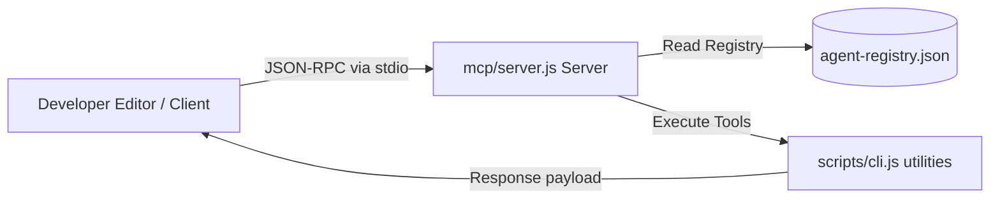

<div align="center">
The Open-Source AI Career Operating System for Software Engineers

<p align="center">
  
</p>

Career OS is an enterprise-grade, open-source personal career optimization suite designed to automate and systemize professional growth. By unifying 146 specialized AI agents, local ATS resume grading, public GitHub profile auditing, search-visibility LinkedIn scanning, and interactive STAR behavioral mock interviews, it replaces generic prompts and static templates with a context-aware career intelligence cockpit.

</div>

---

## Badges

<p align="center">
  <a href="https://www.npmjs.com/package/career-agents"></a>
  <a href="https://www.npmjs.com/package/career-agents"></a>
  <a href="./LICENSE"></a>
  <a href="https://github.com/karthikrshet/Career-Agents"></a>
  <a href="https://github.com/karthikrshet/Career-Agents/network/members"></a>
  <a href="https://github.com/karthikrshet/Career-Agents/releases"></a>
  <a href="https://github.com/karthikrshet/Career-Agents/issues"></a>
  <a href="https://github.com/karthikrshet/Career-Agents/pulls"></a>
  <a href="https://github.com/karthikrshet/Career-Agents/graphs/contributors"></a>
  <a href="https://github.com/karthikrshet/Career-Agents/actions/workflows/ci.yml"></a>
  <a href="https://www.typescriptlang.org/"></a>
  <a href="https://nextjs.org/"></a>
  <a href="https://react.dev/"></a>
  <a href="https://nodejs.org/"></a>
  <a href="https://modelcontextprotocol.io/"></a>
  <a href="https://github.com/karthikrshet/Career-Agents/actions/workflows/codeql.yml"></a>
</p>

---

## Elevator Pitch

Software engineers face a fragmented job application cycle where resumes are filtered by parsing engines, portfolios are checked on GitHub, and behavioral performance is scored via structured framework interviews. Existing consumer AI chatbots lack integration with raw files, OAuth profile contexts, and structured ATS parser scoring. Career OS solves this fragmentation by building a local-first workspace that evaluates career assets, synchronizes target scores into a unified profile state, and exposes these workflows directly to developers inside their IDEs via the Model Context Protocol.

---

## Why Career OS

Traditional career readiness tools fail because they evaluate portfolios and resumes in isolation. General-purpose AI chatbots fail because they require developers to manually copy-paste resume templates, terminal outputs, and system architecture descriptions into separate windows, losing continuity across sessions. 

Career OS takes a different approach:
- **Heuristic + AI ATS Parsing:** Integrates regex section scanners and action-verb checking with LLM-powered bullet optimization.
- **Context-Aware Routing:** The Career Copilot reads the user's active resume scores, GitHub repo counts, and target titles, automatically routing queries to the most qualified agent in the 146-agent registry.
- **Zero-Key Privacy:** Stores sensitive API keys in the browser's `localStorage` rather than database systems, safeguarding user credentials.
- **IDE Native:** Runs an stdio Model Context Protocol (MCP) server so that developer tools can parse profiles, run mock interviews, and optimize code right inside code editors.

---

## Screenshots

<details>
<summary>View Dashboard Preview</summary>

*Displays global metrics, 5-dimensional career scores, recent activity feeds, and quick actions.*

</details>

<details>
<summary>View Resume Studio Preview</summary>

*Scans document formatting, highlights missing keywords, and suggests bullet-point improvements.*

</details>

<details>
<summary>View GitHub Wrapped Preview</summary>

*Analyzes public repository counts, language distribution, star scores, and documentation completeness.*

</details>

<details>
<summary>View LinkedIn Optimizer Preview</summary>

*Grades headline positioning, about summaries, and searches keyword density.*

</details>

<details>
<summary>View Interview Lab Preview</summary>

*Conducts mock interviews across 10 company tracks, featuring integrated coding canvases and scorecards.*

</details>

<details>
<summary>View Marketplace Preview</summary>

*Enable or disable plugin extensions and review required context permissions.*

</details>

---

## Demo

- **Live Demo Instance:** [career-os.dev](https://career-os.dev) (Local guest mode active)
- **GitHub Repository:** [github.com/karthikrshet/Career-Agents](https://github.com/karthikrshet/Career-Agents)
- **NPM Package Registry:** [npmjs.com/package/career-agents](https://www.npmjs.com/package/career-agents)
- **Documentation index:** [docs/README.md](./docs/README.md)
- **Video Walkthrough:** [YouTube Video Walkthrough](https://youtube.com)

---

## Features

### Core Systems
- **Interactive Dashboard:** Aggregates career indicators, displays score progress rings, and tracks metrics history.
- **Kanban Job Tracker:** Drags cards across Kanban lists (Wishlist, Applied, Interview, Offer, Rejected) to calculate progress metrics.
- **Persistent Storage:** Zustand core with `persist` middleware synchronizes state with browser database systems or PostgreSQL tables.
- **OAuth Authentication:** Integrates GitHub and Google NextAuth credentials with automatic profile sync.

### Artificial Intelligence
- **146 Specialized Agents:** Executes prompt configurations derived from 19 domains of expert coaching.
- **Provider Abstraction Router:** Single client-side and server-side package router to access 14 API backends.
- **Real-Time Streaming:** Streams tokens using Server-Sent Events (SSE) for low latency.

### Resume & Portfolios
- **Resume Studio:** Parses DOCX, PDF, and text formats to evaluate section density, star formulas, and passive verbs.
- **GitHub Wrapped:** Pulls public repository count, tags, languages, and star weight scores from the REST API.
- **LinkedIn Auditor:** Checks search density index, headline structures, and profile copy.

### MCP & CLI
- **25 MCP Tools:** Connects IDE sessions to the local registry, allowing AI models to execute roadmaps and run mock interviews.
- **CLI Utility:** Runs local diagnostics, doctor checks, profile scans, and terminal mock interviews.

### Exports & Operations
- **Report Compiler:** Compiles HTML, Markdown, PDF (`pdf-lib`), Word (`docx`), and Excel (`exceljs`) files.
- **Content Security Policy:** Strict CSP configuration, HSTS protection, and rate-limiting rules.
- **Enterprise SEO:** Outfitted with robots configuration, structured JSON-LD schemes, sitemap indices, and llms.txt discoverability formats.

---

## Feature Matrix

| Feature Module | CLI Utility | Web Dashboard | MCP Server |
|----------------|-------------|---------------|------------|
| Agent Directory Search | ✅ | ✅ | ✅ |
| Resume ATS Scoring | ✅ | ✅ | ✅ |
| GitHub Profile Wrapped | ✅ | ✅ | ✅ |
| LinkedIn Headline Check | ✅ | ✅ | ✅ |
| Mock Interview Engine | ✅ | ✅ | ✅ |
| PDF/Word/Excel Export | ❌ | ✅ | ✅ |
| Kanban Job Tracking | ❌ | ✅ | ✅ |
| Chat History Storage | ❌ | ✅ | ❌ |
| Multi-agent Routing | ❌ | ✅ | ❌ |

---

## AI Agent Ecosystem

Career OS manages **146 agents** categorized across **19 divisions**. When a user prompts the Copilot, the routing engine tokenizes the query and compares it against agent names, descriptions, tags, and required skills to construct a matching scorecard:

```
Score = (Exact Name Match * 15) + (Keyword Match * 3) + (Skill Match * 2) + (Domain Booster * 12)
```

The top 3 matching agents with score >= 5 are compiled, their Markdown prompt bodies are read from the filesystem, and their instructions are appended to the system prompt alongside the user's active profile metrics.

### Division Summary Table

| Division | Count | Focus | Target Input | Expected Output |
|----------|-------|-------|--------------|-----------------|
| **career** | 33 | Job search, career roadmaps | Target role / experience | Pivot milestones, timeline |
| **company-interviews** | 10 | Company specific interview prep | Target FAANG company | Values-aligned prep checklist |
| **ai-engineering** | 10 | Prompting, fine-tuning, architecture | LLM/ML systems queries | Target models, RAG workflows |
| **cloud** | 10 | AWS, GCP, Platform tooling | IaC code / configuration | Kubernetes/Terraform review |
| **cybersecurity** | 10 | Pen-testing, GRC compliance | Compliance framework | SOC2 / OWASP checks |
| **open-source** | 10 | GitHub growth, OSS contributions | Project repo URL | README optimization recommendations |
| **data-engineering** | 10 | Pipelines, analytics database | Pipeline scripts | ETL designs, Spark suggestions |
| **devrel** | 10 | Developer advocacy, DX | Developer content | CFP outlines, DX strategies |
| **resume** | 9 | Bullet-point structure, achievements | Raw resume text | Action-verb STAR bullet outputs |
| **engineering** | 6 | API routing, systems scale | System requirements | Architecture sketches |
| **interview** | 5 | Mock interviews, STAR scoring | User interview answer | Scoring scorecard, improvements |
| **networking** | 5 | Cold emails, LinkedIn DMs | Target contact / company | Communication outreach templates |
| **projects** | 4 | Research and academic defenses | Thesis topic / draft | Viva prep questions |
| **startup** | 4 | Market research, GTM | Product concept | Competitive matrix, GTM |
| **gtm** | 2 | Clay operations, sales loops | Prospect lists | Automation workflows |
| **faang** | 2 | OpenAI and Google Swe prep | Coding requirements | LeetCode patterns |
| **job-automation**| 2 | Automated job tracking | Job details | Tracker updates |
| **ai-business** | 2 | AI consulting | Client specs | Deliverable blueprints |
| **freelancing** | 2 | Upwork profile | Proposal text | Bid pitch drafts |

*For the complete agent index, see [docs/AGENTS.md](./docs/AGENTS.md).*

---

## AI Providers

Career OS supports 14 providers. The router evaluates API keys from the browser's `localStorage` settings config first, falling back to server-side environment variables if the local config is empty:

| Provider | Status | Default Model | Free Tier | Streaming | Vision |
|----------|--------|--------------|-----------|-----------|--------|
| **Groq** | ✅ Active | `llama-3.3-70b-versatile` | ✅ Yes | ✅ Yes | ❌ |
| **Google Gemini** | ✅ Active | `gemini-2.5-pro` | ✅ Yes | ✅ Yes | ✅ Yes |
| **OpenAI** | ✅ Active | `gpt-4o` | ❌ No | ✅ Yes | ✅ Yes |
| **Anthropic** | ✅ Active | `claude-3-5-sonnet-20241022`| ❌ No | ✅ Yes | ✅ Yes |
| **DeepSeek** | ✅ Active | `deepseek-chat` | ❌ Cheap | ✅ Yes | ❌ |
| **OpenRouter** | ✅ Active | `openai/gpt-4o` | ✅ Yes | ✅ Yes | ✅ Yes |
| **Together AI** | ✅ Active | `meta-llama/Llama-3-70b-chat`| ❌ No | ✅ Yes | ❌ |
| **Mistral** | ✅ Active | `mistral-large-latest` | ❌ No | ✅ Yes | ❌ |
| **Cohere** | ✅ Active | `command-r-plus` | ✅ Trial | ✅ Yes | ❌ |
| **xAI Grok** | ✅ Active | `grok-2` | ❌ No | ✅ Yes | ❌ |
| **Azure OpenAI** | ✅ Active | Custom deployment | ❌ Enterprise| ✅ Yes | ✅ Yes |
| **Ollama** | ✅ Active (Local) | User pulled (e.g. `llama3`) | ✅ Yes | ✅ Yes | ❌ |
| **LM Studio** | ✅ Active (Local) | Custom loaded GGUF | ✅ Yes | ✅ Yes | ❌ |

---

## Architecture

### System Data Flow


```mermaid
sequenceDiagram
    participant User as User / Browser
    participant SW as Service Worker (PWA)
    participant NextJS as Next.js Web App
    participant Router as AI Provider Router
    participant DB as PostgreSQL (Prisma)
    
    User->>SW: Access Career OS Pages
    SW->>User: Serve cached layout assets (Offline support)
    User->>NextJS: Request Resume/GitHub Audit
    NextJS->>Router: Forward file/profile buffer
    Router->>Router: Match and load agent prompts
    Router->>User: Stream SSE completion chunks
    NextJS->>DB: Sync user session & metrics history
    DB-->>NextJS: Write confirmation
```

### Model Context Protocol (MCP) Integration


```mermaid
graph LR
    IDE[Developer Editor / Client] -->|JSON-RPC via stdio| MCPServer[mcp/server.js Server]
    MCPServer -->|Read Registry| Files[(agent-registry.json)]
    MCPServer -->|Execute Tools| CoreScripts[scripts/cli.js utilities]
    CoreScripts -->|Response payload| IDE
```

---

## Project Structure

```
Career-Agents/
├── apps/
│   └── web/                   ← Web application using Next.js 14 App Router
│       ├── prisma/            ← PostgreSQL prisma schema definition and migrations
│       ├── public/            ← Static logos, visual gifs, service workers, manifest
│       └── src/
│           ├── app/           ← Web layout pages and server-side /api route endpoints
│           ├── components/    ← Common React widgets, sidebar structures, buttons, and metrics
│           ├── hooks/         ← Custom React hooks (e.g. command palette listeners)
│           ├── lib/           ← Logic, local storage serialization, and Zustand store
│           └── types/         ← Common TypeScript interfaces
│
├── packages/
│   └── ai/                    ← Modular package router interface for the 14 providers
│
├── mcp/                       ← Stdio-based Model Context Protocol server exposing tools
│
├── scripts/                   ← Platform CLI, SDK interface, validate and compile scripts
│
└── [divisions]/               ← Raw Markdown prompt files for the 146 agents
```

- **`apps/web` exists because:** It hosts the Next.js single-page application dashboard, routing logic, state management, and user views.
- **`packages/ai` exists because:** It isolates raw API connections to external AI models from front-end page layouts, ensuring portability.
- **`mcp` exists because:** It enables developers to access their career profiles, run checklists, and invoke agents without leaving their code editor.
- **`scripts` exists because:** It provides terminal utilities for data mapping, schema validation, and package publishing.

---

## Installation

### Prerequisites
- Node.js >= 18.0.0 (Node 20 LTS recommended)
- Git
- Python 3.9+ (required for agent validation scripts)

### Setup Steps
```bash
# 1. Clone the repository
git clone https://github.com/karthikrshet/Career-Agents.git
cd Career-Agents

# 2. Install web application dependencies
cd apps/web
npm install

# 3. Configure environment
cp .env.example .env
# Edit .env and enter a random NEXTAUTH_SECRET (e.g. openssl rand -base64 32)
```

### Database Modes
- **Guest Mode (Default):** Runs without configuring database parameters. Data is saved in the browser's `localStorage` database using Zustand's persistence manager.
- **Database Mode:** Set `DATABASE_URL` in `.env` to point to a PostgreSQL database, then push the Prisma schema:
  ```bash
  npx prisma db push
  ```

---

## Quick Start

Get Career OS running locally in under 5 minutes:

```bash
# Clone and build dependencies
git clone https://github.com/karthikrshet/Career-Agents.git
cd Career-Agents/apps/web
npm install

# Setup environment variables
cp .env.example .env
# Set NEXTAUTH_SECRET

# Run the local development server
npm run dev
```

Open [http://localhost:3000](http://localhost:3000) and configure your AI key under **Settings** -> **AI Provider** -> **Groq** to enable completions.

---

## Environment Variables

| Variable | Required | Default | Description / Security Notes |
|----------|----------|---------|------------------------------|
| `NEXTAUTH_SECRET` | Yes | None | Secret key used to encrypt user sessions. Never share this. |
| `NEXTAUTH_URL` | Yes | `http://localhost:3000` | Canonical URL of your app deployment. |
| `DATABASE_URL` | No | None | Postgres connection string. If blank, app operates in Guest Mode. |
| `GITHUB_CLIENT_ID` / `GITHUB_CLIENT_SECRET` | No | None | OAuth application keys generated via GitHub Developer settings. |
| `GOOGLE_CLIENT_ID` / `GOOGLE_CLIENT_SECRET` | No | None | OAuth application keys generated via Google Cloud Console. |
| `GROQ_API_KEY` | No | None | Server-side fallback key for Groq AI completions. |
| `GEMINI_API_KEY` | No | None | Server-side fallback key for Google Gemini completions. |
| `GITHUB_TOKEN` | No | None | Read-only GitHub PAT used to increase GitHub API limit to 5000/hr. |
| `REDIS_URL` | No | None | Redis connection string used for optional API route rate limiting. |
| `LOG_LEVEL` | No | `info` | Logging verbosity level on NextJS console (`debug`, `info`, `warn`, `error`). |

---

## CLI Documentation

Career OS includes a terminal utility under `scripts/cli.js`.

| Command | Arguments | Purpose | Example |
|---------|-----------|---------|---------|
| `list` | None | Lists all registered divisions and agents | `node scripts/cli.js list` |
| `doctor` | None | Performs dependencies and environment validation checks | `node scripts/cli.js doctor` |
| `score` | `<filepath>` | Scans PDF/Word resumes and outputs ATS score | `node scripts/cli.js score resume.pdf` |
| `review` | `<filepath>` | Performs weak bullet checking and spelling audits | `node scripts/cli.js review resume.pdf` |
| `github` | `<username>` | Runs portfolio wrapped check for target profile | `node scripts/cli.js github torvalds` |
| `mock` | `<company> <mode>`| Starts a terminal mock interview drill | `node scripts/cli.js mock google behavioral` |
| `roadmap`| `<target>` | Generates study roadmaps in markdown formats | `node scripts/cli.js roadmap "staff engineer"` |

---

## Web Dashboard

The web dashboard is organized into page modules:
- **Dashboard (`/`):** View overall scores, metrics graphs, activity feeds, and quick actions.
- **Resume Studio (`/resume`):** Parse resume files, check ATS formatting issues, and rewrite bullet points.
- **GitHub Analyzer (`/github`):** Audits public repositories, languages, and pinned documentation.
- **LinkedIn Optimizer (`/linkedin`):** Grades headlines and analyzes keyword density.
- **Interview Lab (`/interview`):** STAR-based mock interviews with built-in coding canvases and scorecard evaluations.
- **Job Tracker (`/tracker`):** Kanban layout to track applications, calculate progress metrics, and record recruiter logs.
- **Marketplace (`/marketplace`):** Extensions portal to toggle plugins.
- **Reports (`/reports`):** Compiles analysis findings into PDF, Word, or Excel sheets.
- **MCP integrations (`/mcp`):** Displays setup parameters for desktop and IDE clients.
- **Settings (`/settings`):** Configures active AI providers, models, parameters (temperature), and telemetry flags.
- **About (`/about`):** Browse the 146-agent registry directory and search by keywords or skills.
- **Credits (`/credits`):** Displays project metrics, open-source library links, and project contributors.

---

## Resume Studio

The Resume Studio is a local resume optimization suite featuring:
- **ATS Formatting Checker:** Heuristics search for layout issues that cause parsing errors, such as columns, tables, header icons, and graphics.
- **Action-Verb Checker:** Detects passive/weak verbs (e.g. *assisted*, *helped*), suggesting replacements (e.g. *orchestrated*, *spearheaded*).
- **STAR Validator:** Checks if resume bullet points contain a Situation, Task, Action, and Result, flagging bullets that lack metrics or outcomes.
- **Missing Keyword List:** Compares resume text against ~35 common industry keywords (e.g., CI/CD, Kubernetes, TypeScript) to highlight gaps.
- **AI Rewriter:** Uses your configured AI provider to rewrite weak bullet points.
- **Multiple Exports:** Download your optimized resume as plain text, Markdown, or a styled Word Document (`.docx`).

---

## GitHub Analyzer

The GitHub Analyzer integrates directly with the GitHub REST API (no mocks) to evaluate portfolios:
- **Language Diversity:** Computes a distribution map across your public codebase.
- **Documentation Auditor:** Grades README completeness and checks if projects include proper setup steps.
- **Repository Scorer:** Measures traction signals using stars, forks, and recent commits.
- **Recommendations:** Suggests concrete next steps, like adding descriptions, licenses, or linking live demos.
- **Heatmap:** Displays an activity graph of commits over the past year.

---

## LinkedIn Optimizer

The LinkedIn Optimizer evaluates profile copy to improve search indexing:
- **Headline Scanners:** Verifies pipe-separated headline formats (`Title | Specialization | Value Metric`) used by recruiters.
- **Keyword Density Check:** Checks if your summary contains keywords frequently searched by recruiters for your target role.
- **Summary Grade:** Evaluates paragraph formatting and checks for the presence of contact details and summaries of achievements.
- **Visibility Index:** Calculates a search-readiness index (0-100) based on headline structure and keyword density.

---

## Interview Lab

The Interview Lab conducts realistic mock interviews:
- **Curated Company Tracks:** Custom behavioral interview plans for Adobe, Amazon, Atlassian, Google, Meta, Microsoft, Netflix, Oracle, Salesforce, and Uber.
- **Custom Mode Options:** Choose between Behavioral, Technical (coding), System Design, and HR rounds.
- **Integrated Code Editor:** Built-in code canvas for typing solution structures.
- **STAR Scoring Matrices:** Evaluates responses across 10 parameters (Situation, Task, Action, Result, Ownership, Leadership, Communication, Technical Depth, Problem Solving, Confidence) on a 0-10 scale.
- **Fallback Mode:** Automatically returns 5 curated interview questions per track if no AI provider is configured.

---

## Career Copilot

The Career Copilot is a context-aware chat workspace:
- **Direct Context Injection:** Automatically appends your profile metrics, resume analysis, and GitHub score to the system prompt of every conversation.
- **Multi-Agent Routing:** Automatically routes messages to the most relevant agents based on query keywords.
- **Streaming SSE Output:** Streams tokens in real-time.
- **Attachments:** Drop PDF documents or text files directly into the chat.
- **Folders & Organization:** Create custom folders, pin conversations, search history, and export logs to Markdown.

---

## Marketplace

Extend the Career Copilot's prompt context with modular plugin extensions:
- **STAR Behavioral Coach:** Formats all behavioral responses in STAR tables.
- **LeetCode Tracker:** Tracks coding problems, recommends algorithms, and calculates Big O time/space complexity.
- **Resume PDF Parser:** Adjusts formatting parameters to optimize PDF parsing for ATS systems.
- **Salary Intelligence:** Embeds compensation benchmarks from Glassdoor/Blind.

### Lifecycle Events
```
Available (Marketplace) -> Install (Register keys) -> Enable (Inject Prompt Context) -> Disable -> Uninstall
```

---

## Model Context Protocol (MCP)

Expose Career OS tools directly to your local LLM clients:

### Supported Editors
- **Cursor AI:** Add stdio command `node /absolute/path/to/Career-Agents/mcp/server.js` in Settings -> Features -> MCP.
- **Claude Desktop:** Add configuration block to `claude_desktop_config.json`.
- **VS Code (Continue):** Add to `.continue/config.json`.
- **Cline / Roo Code / Aider / Windsurf / Bolt:** Configure stdio parameters to use the local server path.

### Setup Config Example (Claude Desktop)
```json
{
  "mcpServers": {
    "career-agents": {
      "command": "node",
      "args": ["/absolute/path/to/Career-Agents/mcp/server.js"]
    }
  }
}
```

*For tool parameters and CLI flags, read [docs/MCP.md](./docs/MCP.md).*

---

## REST API Reference

Career OS exposes 10 REST endpoints. For request/response schemas, check [docs/API.md](./docs/API.md):

- `POST /api/copilot` — Streams response tokens using SSE.
- `POST /api/interview` — Generates questions or evaluates answers.
- `POST /api/resume/analyze` — Evaluates resume text against ATS parameters.
- `POST /api/github/analyze` — Pulls public portfolio metrics from the GitHub API.
- `POST /api/linkedin/analyze` — Optimizes LinkedIn headlines and summaries.
- `POST /api/reports/generate` — Compiles and exports reports to PDF, Word, or Excel.
- `POST /api/parse-file` — Extracts plain text from uploaded document files.
- `POST /api/parse-file/url` — Parses files from a public URL.
- `POST /api/providers/test` — Tests connection status and latency for AI providers.
- `GET /api/profile` — Retrieves the authenticated NextAuth user session.

---

## Plugin SDK

Developers can create custom plugins. A plugin is defined as a JSON manifest file containing metadata and system prompt injection rules:

```json
{
  "id": "my-custom-plugin",
  "name": "Custom Plugin",
  "version": "1.0.0",
  "permissions": ["read_profile", "write_copilot_context"],
  "promptInjection": "Always write responses in a concise software design document format."
}
```

### Hooks & Lifecycle
- `onInstall`: Verifies permissions and adds the plugin to the Zustand store.
- `onEnable`: Injects the `promptInjection` string into the Copilot API system context.
- `onDisable`: Removes the injection block from the prompt pipeline.

---

## Security

Career OS is built with enterprise security standards:
- **Zero-Key Storage:** AI provider API keys are saved in browser `localStorage` and never sent to any database.
- **Session Tokens:** NextAuth JWT tokens are signed using `NEXTAUTH_SECRET` and saved in secure HttpOnly, SameSite=Lax cookies.
- **Strict Headers:** Includes Content Security Policy (CSP), HTTP Strict Transport Security (HSTS), and clickjacking safeguards.
- **Validation:** Server endpoints validate inputs using Zod schemas before execution.

---

## Performance

The application is optimized for low latency:
- **Streaming Tokens:** Streams responses via Server-Sent Events (SSE) to show users text instantly.
- **Code Splitting & Suspense:** Lazy-loads charts (`recharts`) and modal windows to reduce initial load size.
- **Asset Caching:** Caches search indices and parsed resume buffers.
- **Dynamic Imports:** Dynamically imports heavy libraries (like `jszip` or `exceljs`) only when needed.

---

## SEO

Career OS implements search engine optimization (SEO) standards:
- **Dynamic Sitemap:** `sitemap.xml` automatically registers all application pages at build time.
- **Structured Data:** Injects structured JSON-LD data into layouts to help search engines understand the site's content.
- **AI Discoverability:** Includes `llms.txt` and `llms-full.txt` (following the llmstxt.org specification) to allow LLM agents to index the repository easily.

---

## Accessibility

The dashboard is built to be accessible to all users:
- **Keyboard Navigation:** Full support for `Cmd+K` / `Ctrl+K` command palettes, search filters, and dialog control.
- **ARIA Standards:** Primitive layout items use Radix UI wrapper tags with complete ARIA attributes.
- **Contrast Ratios:** Background and text combinations meet WCAG AA contrast guidelines.

---

## Testing

Run static linting, type checks, and registry verification scripts before release:

```bash
# 1. Run type safety compiler check
npm run type-check

# 2. Run code style lint check
npm run lint

# 3. Validate agent markdown prompts and links
python scripts/validate.py

# 4. Compile index databases
python scripts/generate-data.py
```

---

## Deployment

Deploy Career OS to production using one of three methods:

- **Vercel:** Connect the repository to Vercel, set root directory to `apps/web`, configure env variables, and deploy.
- **Docker:** Build a container from the root `Dockerfile` using `docker build -t career-os .`.
- **Self-Hosted (Linux/Windows):** Run using a Node.js server with PM2 process manager and an Nginx reverse proxy.
- For complete steps, see [docs/DEPLOYMENT.md](./docs/DEPLOYMENT.md).

---

## Documentation

| Document File | Purpose / Details |
|---------------|-------------------|
| [docs/QUICKSTART.md](./docs/QUICKSTART.md) | Get Career OS running locally in 5 minutes. |
| [docs/INSTALL.md](./docs/INSTALL.md) | Detailed installation steps for all setups. |
| [docs/DEVELOPMENT.md](./docs/DEVELOPMENT.md) | Developer guide, agent schemas, and contributing guidelines. |
| [docs/ARCHITECTURE.md](./docs/ARCHITECTURE.md) | Architecture models and request flows. |
| [docs/API.md](./docs/API.md) | Full REST API reference with payload schemas. |
| [docs/AGENTS.md](./docs/AGENTS.md) | List of all 146 agents by division. |
| [docs/PROVIDERS.md](./docs/PROVIDERS.md) | Configuration steps for the 14 AI providers. |
| [docs/MCP.md](./docs/MCP.md) | Model Context Protocol IDE installation guide. |
| [docs/PLUGINS.md](./docs/PLUGINS.md) | Plugin marketplace architecture and lifecycle. |
| [docs/DATABASE.md](./docs/DATABASE.md) | Prisma schema models and migrations. |
| [docs/SECURITY.md](./docs/SECURITY.md) | Security policy and practices. |
| [docs/DEPLOYMENT.md](./docs/DEPLOYMENT.md) | Deploying to Vercel, Docker, and self-hosted environments. |
| [docs/TROUBLESHOOTING.md](./docs/TROUBLESHOOTING.md) | Common errors and step-by-step fixes. |
| [docs/FAQ.md](./docs/FAQ.md) | Answers to frequently asked questions. |
| [docs/CONFIGURATION.md](./docs/CONFIGURATION.md) | Feature flags and Next.js setup guide. |
| [docs/ENVIRONMENT_VARIABLES.md](./docs/ENVIRONMENT_VARIABLES.md) | Environment variables reference. |
| [docs/AI_ROUTER.md](./docs/AI_ROUTER.md) | AI routing architecture and error handling. |
| [docs/FILE_UPLOADS.md](./docs/FILE_UPLOADS.md) | File formats, size limits, and parsing engine. |
| [docs/EXPORTS.md](./docs/EXPORTS.md) | Exporting reports to PDF, Word, and Excel. |
| [docs/SEARCH.md](./docs/SEARCH.md) | Search index and matching algorithms. |
| [docs/THEMING.md](./docs/THEMING.md) | Custom themes and Tailwind design tokens. |
| [docs/TESTING.md](./docs/TESTING.md) | Testing and validation guide. |
| [docs/RELEASE.md](./docs/RELEASE.md) | Tagging releases and publishing to npm. |

---

## Roadmap

- **v2.5.0 (Current):** Complete enterprise-grade documentation, Next.js build verification, and clean tagging.
- **v2.6.0 (Next):** Real-time voice interview drills and WebRTC integration.
- **v2.7.0:** Direct LinkedIn Profile API OAuth imports.
- **v2.8.0:** Local offline AI support running inside web browsers via WebGPU.
- **v3.0.0:** Multi-user team workspaces and shared organization dashboard layouts.

---

## Contributing

We welcome community contributions:
- **Branching Strategy:** Create features on branches prefixed with `feature/` or `fix/`.
- **Validation:** Changes must pass `npm run type-check`, `npm run lint`, and `python scripts/validate.py`.
- **Commit Messages:** Follow [Conventional Commits](https://www.conventionalcommits.org/).
- For complete rules, see [CONTRIBUTING.md](./CONTRIBUTING.md).

---

## Community

- **Discussions:** Ask questions, share ideas, and get support in [GitHub Discussions](https://github.com/karthikrshet/Career-Agents/discussions).
- **Issues:** Report bugs or request features using [GitHub Issues](https://github.com/karthikrshet/Career-Agents/issues).
- **Sponsors:** Support ongoing development via [GitHub Sponsors](https://github.com/sponsors/karthikrshet).
- **Contributors:** Review the list of active contributors on the [/credits](https://career-os.vercel.app/credits) page.

---

## FAQ

**Q: Can I use Career OS without an API key?**  
A: Yes. Resume ATS scans and GitHub score calculation run fully offline without any keys. Interactive chat features require a key.

**Q: Where are my API keys saved?**  
A: Keys are stored locally in your browser's `localStorage` and never sent to any database or third-party servers.

**Q: How do I resolve a 429 Too Many Requests error?**  
A: This occurs when you exceed your AI provider's rate limits. Wait 60 seconds or switch to a different provider under settings.

---

## Acknowledgements

- **Frontend:** Next.js, React, Tailwind CSS, Lucide Icons, Framer Motion, Radix UI.
- **Calculations & Parsers:** `pdf-parse`, `jszip`, `exceljs`, `docx`, `pdf-lib`.
- **AI Integrations:** OpenAI, Anthropic, Google Gemini, Groq.

---

## License

This repository is licensed under the MIT License — see [LICENSE](./LICENSE) for details.

---

<div align="center">

**[GitHub Repository](https://github.com/karthikrshet/Career-Agents) · [Live Platform](https://career-os.dev) · [NPM Registry](https://www.npmjs.com/package/career-agents) · [Documentation Hub](./docs/README.md)**

[Draft Release](https://github.com/karthikrshet/Career-Agents/releases) · [Report Bug](https://github.com/karthikrshet/Career-Agents/issues/new?template=BUG_REPORT.md) · [Request Feature](https://github.com/karthikrshet/Career-Agents/issues/new?template=FEATURE_REQUEST.md) · [Ask Question](https://github.com/karthikrshet/Career-Agents/issues/new?template=QUESTION.md)

</div>
