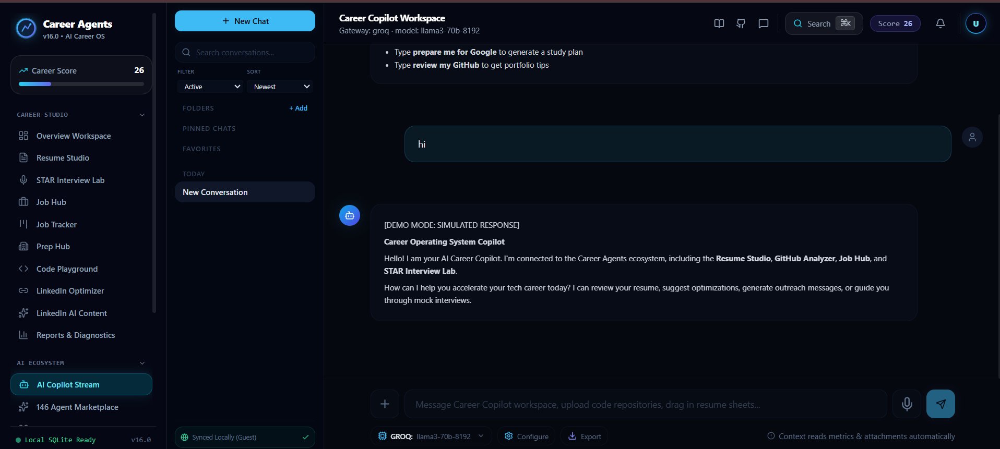
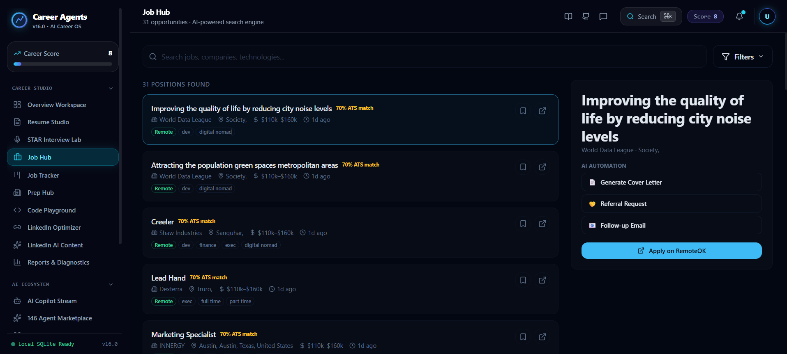
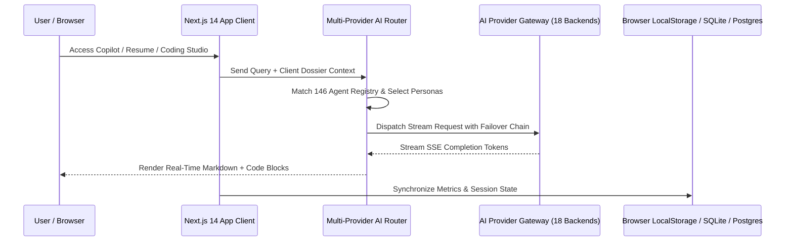
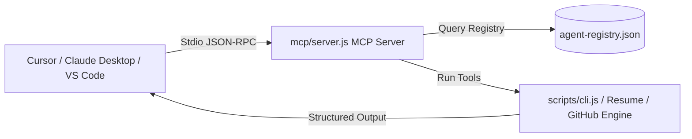

<div align="center">


# ⚡ Career Agents: The AI Career Operating System

### The Open-Source Personal Career Optimization Suite & MCP Infrastructure for Software Engineers

<p align="center">
  
</p>

**Career Agents** is an enterprise-grade, open-source AI platform designed to automate and systemize professional tech career growth. Unifying **146 specialized AI agents across 19 divisions**, local heuristic ATS resume scoring, public GitHub portfolio auditing, search-visibility LinkedIn scanning, a **20-language LeetCode Coding Studio with 240+ problems**, and interactive STAR behavioral mock interviews — it replaces static prompts and fragmented tools with a context-aware career intelligence cockpit.

[Live Demo](https://career-os.dev) · [NPM Package](https://www.npmjs.com/package/career-agents) · [Documentation Hub](./docs/README.md) · [Report Bug](https://github.com/karthikrshet/Career-Agents/issues/new?template=BUG_REPORT.md)

</div>

---

## 📊 Badges & Status

<p align="center">
  <a href="https://www.npmjs.com/package/career-agents"></a>
  <a href="https://www.npmjs.com/package/career-agents"></a>
  <a href="./LICENSE"></a>
  <a href="https://github.com/karthikrshet/Career-Agents"></a>
  <a href="https://github.com/karthikrshet/Career-Agents/network/members"></a>
  <a href="https://github.com/karthikrshet/Career-Agents/releases"></a>
  <a href="https://github.com/karthikrshet/Career-Agents/issues"></a>
  <a href="https://github.com/karthikrshet/Career-Agents/actions/workflows/ci.yml"></a>
  <a href="https://www.typescriptlang.org/"></a>
  <a href="https://nextjs.org/"></a>
  <a href="https://react.dev/"></a>
  <a href="https://nodejs.org/"></a>
  <a href="https://modelcontextprotocol.io/"></a>
</p>

---

## 🎯 Why Software Engineers Need Career Agents

Software engineers face a fragmented job application ecosystem:
- **Resumes** are screened by ruthless ATS regex parsers before a recruiter reads them.
- **Portfolios** are judged by public GitHub activity, language diversity, and documentation completeness.
- **LinkedIn Profiles** are indexed by recruiter search algorithms that filter by headline keywords.
- **Technical & Behavioral Interviews** demand rigorous STAR method metrics and rapid coding under timed constraints.

Existing AI chatbots fail because they treat each prompt in isolation, forcing candidates to repeatedly copy-paste resumes, terminal outputs, and system architecture specs into separate chat windows.

### The Career Agents Solution:
1. **Unified Dossier State:** A local-first state engine synchronizes your ATS scores, GitHub metrics, target roles, and interview progress into a single system memory.
2. **Dynamic 146-Agent Router:** Automatically matches queries against 146 specialized domain personas (e.g. *Senior System Architect*, *STAR Behavioral Coach*, *Placement Strategist*).
3. **Multi-Provider Failover Gateway:** Connects to 18 AI backends (Groq, Gemini, OpenAI, Claude, DeepSeek, xAI Grok, Ollama, LM Studio) with zero setup required and automatic failover guarantees.
4. **IDE Native via MCP Protocol:** Exposes 25 Model Context Protocol (MCP) stdio tools so Cursor, Claude Desktop, VS Code, and Windsurf can evaluate resumes, generate roadmaps, and run mock interviews right inside your code editor.

---

## 📸 Screenshots & Visual Product Tour

<div align="center">

### 🌐 Landing Page & System Cockpit
*The unified entry point highlighting live agent telemetry, local ATS tools, and zero-key privacy.*


### 🚀 Interactive Product Workspace Overview
*Centralized control panel inspecting live agent status streams, local SQLite sync, and quick audit triggers.*


### 💻 AI Copilot Stream Workspace
*Context-aware chat workspace featuring multi-provider model switching, reasoning timeline traces, and downloadable file generation.*


### ⚡ Next-Gen Coding Studio (LeetCode Workspace)
*Practice 240+ coding interview problems with 20-language execution, algorithm visualizers, STAR coding coaches, and virtual contests.*


### 📚 Problem Catalog & Curated Interview Roadmaps
*Filter by Blind 75, NeetCode 150, Top 150, or company-specific question sets (Google, Meta, Amazon, Microsoft, Apple, Netflix, Stripe, OpenAI).*


### 💼 Job Hub & AI Search Engine
*Discover open opportunities with real-time ATS match percentage calculations, one-click cover letter generation, and referral request drafting.*


</div>

---

## ⚡ Complete Feature Suite

### 1. 🤖 AI Copilot Stream & 146 Agent Ecosystem
- **146 Specialized Agents:** Divided across 19 domain divisions (Engineering, System Design, Placements, Resume ATS, FAANG Interview, Executive Coaching).
- **Keyword & Skill Router:** Dynamically scores queries (`Score = Name*15 + Keyword*3 + Skill*2 + Domain*12`) to inject top matching agent personas into the LLM system prompt.
- **Reasoning Timeline Trace:** Displays real-time agent selection timelines, execution latency (ms), confidence scores, and token costs.
- **Document Directives:** Supports exporting custom responses to styled PDF, Word (DOCX), Excel (CSV), and Markdown formats.

### 2. 💻 Next-Gen Coding Studio (LeetCode Workspace)
- **20-Language Compiler:** Execute code in C, C++, Java, Python, Python3, JavaScript, TypeScript, Go, Rust, Kotlin, Swift, Dart, PHP, Ruby, Scala, C#, Elixir, Erlang, Racket, and Bash via Judge0, Piston API, and local sandboxes.
- **240+ Coding Problems:** Curated question sets categorized by Blind 75, NeetCode 150, Top 150, and FAANG company tracks.
- **Interactive Algorithm Visualizers:** Step-by-step visual animations for Two Pointers, Binary Search, Sorting, Stacks, Linked Lists, and Dynamic Programming (Kadane's).
- **Data Structure Whiteboard Canvas:** Interactive drawing board for Trees, Graphs, Linked Lists, Heaps, and Flowcharts.
- **AI STAR Coding Coach:** Get progressive hints, dry-run code explanations, Big-O complexity breakdowns, edge case checks, and STAR behavioral interview linkages.

### 3. 📄 ATS Resume Studio & 20 Built-In Templates
- **20 ATS Resume Templates:** Includes templates for Freshers, SWE Interns, Senior Engineers, Full-Stack Developers, DevOps Engineers, and FAANG ATS Masters.
- **Parser Heuristic Scanner:** Checks layout formatting for common ATS failure points (multi-column tables, text boxes, graphic icons).
- **Action-Verb & STAR Auditor:** Identifies passive verbs (e.g. *assisted*, *helped*) and flags bullets lacking metric outcomes.
- **Keyword Density Check:** Matches resume terms against industry keywords for your target role.

### 4. 🎯 STAR Mock Interview Lab
- **10 FAANG Company Tracks:** Dedicated interview tracks for Google, Meta, Amazon, Microsoft, Apple, Netflix, Stripe, Uber, Atlassian, and Databricks.
- **Interactive Code Canvas:** Code solutions live during technical and system design rounds.
- **10-Parameter Rubric Matrix:** Evaluates responses across Situation, Task, Action, Result, Ownership, Leadership, Technical Depth, Problem Solving, Communication, and Confidence.

### 5. 🐙 GitHub Profile Analyzer & Wrapped
- **Repository Star Metrics & Language Breakdown:** Pulls public repository data directly from the GitHub REST API.
- **Documentation Auditor:** Grades README completeness, setup instructions, and code license coverage.
- **Contribution Heatmap:** Visualizes commit activity over the past year.

### 6. 💼 Job Hub & Kanban Job Tracker
- **5 Kanban Application Stages:** Drag cards across Wishlist, Applied, Interview, Offer, and Rejected lists.
- **Recruiter Log Management:** Log follow-up dates, interviewer contacts, and salary expectations.

---

## 🏗️ Architecture & Data Flow

### System Data Flow Architecture


```mermaid
sequenceDiagram
    participant User as User / Browser
    participant Client as Next.js 14 App Client
    participant Router as Multi-Provider AI Router
    participant LLM as AI Provider Gateway (18 Backends)
    participant DB as Browser LocalStorage / SQLite / Postgres
    
    User->>Client: Access Copilot / Resume / Coding Studio
    Client->>Router: Send Query + Client Dossier Context
    Router->>Router: Match 146 Agent Registry & Select Personas
    Router->>LLM: Dispatch Stream Request with Failover Chain
    LLM-->>Router: Stream SSE Completion Tokens
    Router-->>User: Render Real-Time Markdown + Code Blocks
    Client->>DB: Synchronize Metrics & Session State
```

### Model Context Protocol (MCP) IDE Integration


```mermaid
graph LR
    IDE[Cursor / Claude Desktop / VS Code] -->|Stdio JSON-RPC| MCPServer[mcp/server.js MCP Server]
    MCPServer -->|Query Registry| Registry[(agent-registry.json)]
    MCPServer -->|Run Tools| Tools[scripts/cli.js / Resume / GitHub Engine]
    Tools -->|Structured Output| IDE
```

---

## 🌐 AI Gateway & Supported Providers

Career Agents features a multi-provider gateway supporting **18 AI backends** with zero-key guest fallbacks:

| Provider | Status | Default Model | Free Tier | Streaming | Vision |
|----------|--------|--------------|-----------|-----------|--------|
| **Groq** | ✅ Active | `llama-3.3-70b-versatile` | ✅ Yes | ✅ Yes | ❌ |
| **Google Gemini** | ✅ Active | `gemini-2.5-pro` | ✅ Yes | ✅ Yes | ✅ Yes |
| **OpenAI** | ✅ Active | `gpt-4o` | ❌ No | ✅ Yes | ✅ Yes |
| **Anthropic Claude** | ✅ Active | `claude-3-5-sonnet-20241022`| ❌ No | ✅ Yes | ✅ Yes |
| **DeepSeek** | ✅ Active | `deepseek-chat` | ❌ Cheap | ✅ Yes | ❌ |
| **OpenRouter** | ✅ Active | `meta-llama/llama-3.1-405b` | ✅ Yes | ✅ Yes | ✅ Yes |
| **Together AI** | ✅ Active | `meta-llama/Llama-3-70b-chat`| ❌ No | ✅ Yes | ❌ |
| **Mistral** | ✅ Active | `mistral-large-latest` | ❌ No | ✅ Yes | ❌ |
| **Cohere** | ✅ Active | `command-r-plus` | ✅ Trial | ✅ Yes | ❌ |
| **xAI Grok** | ✅ Active | `grok-2` | ❌ No | ✅ Yes | ❌ |
| **Azure OpenAI** | ✅ Active | Custom deployment | ❌ Enterprise| ✅ Yes | ✅ Yes |
| **Ollama** | ✅ Active (Local) | User pulled (`llama3.3`) | ✅ Yes | ✅ Yes | ❌ |
| **LM Studio** | ✅ Active (Local) | Custom loaded GGUF | ✅ Yes | ✅ Yes | ❌ |

---

## 🛠️ Model Context Protocol (MCP) IDE Setup

Expose Career Agents tools directly to your AI code editors:

### Supported Editors
- **Cursor AI:** Add stdio command `node /absolute/path/to/Career-Agents/mcp/server.js` in Settings -> Features -> MCP.
- **Claude Desktop:** Add configuration block to `claude_desktop_config.json`.
- **VS Code (Continue Extension):** Add to `.continue/config.json`.
- **Windsurf / Aider / Bolt:** Configure stdio parameters to use the local server path.

### Configuration Example (`claude_desktop_config.json`)
```json
{
  "mcpServers": {
    "career-agents": {
      "command": "node",
      "args": ["/absolute/path/to/Career-Agents/mcp/server.js"]
    }
  }
}
```

---

## ⚙️ Installation & Setup

### Prerequisites
- Node.js >= 18.0.0 (Node 20 LTS recommended)
- Git
- Python 3.9+ (required for data validation scripts)

### Quick Start (Under 5 Minutes)
```bash
# 1. Clone repository
git clone https://github.com/karthikrshet/Career-Agents.git
cd Career-Agents

# 2. Install web application dependencies
cd apps/web
npm install

# 3. Setup environment configuration
cp .env.example .env
# Set NEXTAUTH_SECRET (e.g. openssl rand -base64 32)

# 4. Start local development server
npm run dev
```

Open [http://localhost:3000](http://localhost:3000) in your browser. The application runs immediately in **Guest Mode** with full zero-key environment AI fallbacks enabled out of the box!

---

## 🖥️ CLI Utilities

Run terminal commands via `scripts/cli.js`:

```bash
# List all 146 agents and 19 divisions
node scripts/cli.js list

# Run ATS resume score audit
node scripts/cli.js score resume.pdf

# Run GitHub profile wrapped audit
node scripts/cli.js github torvalds

# Start terminal STAR mock interview drill
node scripts/cli.js mock google behavioral
```

---

## 📂 Project Structure

```
Career-Agents/
├── apps/
│   └── web/                   ← Next.js 14 Web Application (App Router, Tailwind, Zustand)
│       ├── public/images/     ← High-res product screenshots & media assets
│       └── src/app/           ← App pages (/copilot, /resume, /playground, /interview, /github)
├── packages/
│   ├── ai/                    ← Multi-provider API abstraction adapters
│   ├── ai-router/             ← AI Gateway & failover routing engine
│   └── brain/                 ← Context compilation & 146 Agent Orchestrator
├── mcp/                       ← Stdio Model Context Protocol Server (25 tools)
├── resume-templates.json      ← 20 ATS Resume Templates Registry
├── agent-registry.json        ← 146 AI Agent Master Registry
└── scripts/                   ← generate-data.py, validate.py, and cli.js utilities
```

---

## 🤝 Contributing & Sponsorship

We welcome contributions from the community!

### Contribution Workflow:
1. Fork and clone the repository.
2. Create a feature branch (`git checkout -b feature/my-cool-feature`).
3. Run verification scripts before committing:
   ```bash
   npm run type-check
   python scripts/generate-data.py
   python scripts/validate.py
   ```
4. Push and open a Pull Request.

### Sponsor Ongoing Development:
If Career Agents has helped you land software engineering interviews, consider sponsoring the project on [GitHub Sponsors](https://github.com/sponsors/karthikrshet)!

---

## 📜 License

Distributed under the **MIT License**. See [LICENSE](./LICENSE) for details.

<div align="center">

**[GitHub Repository](https://github.com/karthikrshet/Career-Agents) · [Live Platform](https://career-os.dev) · [NPM Package](https://www.npmjs.com/package/career-agents) · [Documentation](./docs/README.md)**

</div>
