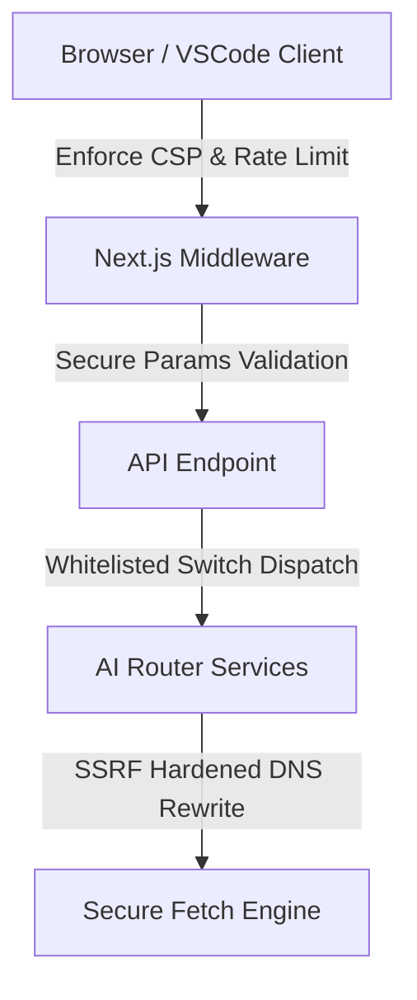

# Security Architecture

This document describes the design principles and defense-in-depth mechanisms implemented in the Career Agents architecture.

## 1. Network Boundary Security (SSRF Protection)
We enforce strict network-level controls using the `secureFetch` mechanism. It resolves hostnames using Node's `dns` module, validates the resolved IP addresses against a blacklist of private/loopback/metadata subnets, rewrites the request URL to target the IP directly, and applies the `Host` header to protect against DNS rebinding.

## 2. Ingress Input Validation & XSS Defenses
Any user input returned in HTML or markdown reports is sanitized via centralized entity escaping rules. This breaks script contexts and neutralizes potential Stored or Reflected XSS vectors.

## 3. Dynamic Dispatch & Reflection Security
We avoid dynamic indexing and runtime constructor reflection. All class instantiations are resolved statically through switch-case statements, blocking arbitrary constructor pollution.
