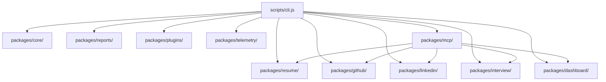

# Career OS System Architecture

This document describes the design patterns, package structures, and interface boundaries of Career OS.

---

## Architectural Philosophy

Career-Agents transitions from a repository of static prompt templates into a structured Career Operating System. The application is designed to be:
1. **Modular**: Feature modules are split into self-contained packages under `packages/`.
2. **Extensible**: New functionality is loaded dynamically via CLI routing, plugin scans, and standard MCP bindings.
3. **Decoupled**: Runtimes, parsers, and command controllers have clear boundaries.

---

## System Flow

---

## Modular Directory Map

### 1. packages/core/
- **Purpose**: Exposes general utilities, roadmap structures, and repository file generation logic.
- **Key Modules**:
  - `executor.js`: Handles AI agent prompt initialization and API connection mappings.
  - `recommender.js`: Evaluates career-os.json metadata to match candidates with specialty coaches.
  - `roadmap.js`: Pre-structures 30-60-90 day milestone guides.
  - `project-generator.js`: Creates boilerplate scaffolding for tech profiles.

### 2. packages/resume/
- **Purpose**: Encapsulates ATS resume review and keyword scoring logic.
- **Key Modules**:
  - `file-parser.js`: Normalizes PDF, Markdown, JSON, and raw text files.
  - `scorer.js`: Measures bullet strength, layout blocks, and computes numeric ATS compatibility scores.
  - `studio.js`: Checks overall completeness and suggests action-verb rewrites.
  - `faang.js`: Validates resumes against targeted Tier-1 tech company competencies.

### 3. packages/github/
- **Purpose**: Audits public developer profiles.
- **Key Modules**:
  - `analyzer.js`: Checks project descriptions, readme visibility, and repository counts.

### 4. packages/linkedin/
- **Purpose**: Evaluates LinkedIn profile copy.
- **Key Modules**:
  - `analyzer.js`: Critiques taglines and highlights keyword signaling indicators.

### 5. packages/interview/
- **Purpose**: Interactive coaching simulator.
- **Key Modules**:
  - `engine.js`: Runs terminal-based readline mock interviews following STAR response structures.

### 6. packages/dashboard/
- **Purpose**: State manager for user milestones.
- **Key Modules**:
  - `profile-manager.js`: Handles serialization of progress files (`.career-profile.json`).
  - `dashboard.js`: Formats visual text-based gauge displays.

### 7. packages/reports/
- **Purpose**: Consolidated outputs compiler.
- **Key Modules**:
  - `reporter.js`: Creates shareable Markdown, JSON, and rich HTML summary cards.

### 8. packages/plugins/
- **Purpose**: Dynamic command registry.
- **Key Modules**:
  - `plugin-manager.js`: Discovers and registers custom commands placed inside `plugins/`.

### 9. packages/telemetry/
- **Purpose**: Execution metrics recorder.
- **Key Modules**:
  - `telemetry.js`: Safely appends anonymized run-time details to local telemetry logs when enabled.

---

## Design Patterns

### 1. Dynamic Imports
To prevent slow launch times and memory leaks, heavy feature modules are imported dynamically only when their respective commands are routed inside `scripts/cli.js`.

### 2. Environment Encapsulation
Database configurations and indices (e.g. `career-os.json`, `search-index.json`, and `knowledge-graph.json`) are compiled and maintained via automated generators (`scripts/generate-data.py`). Command execution processes verify environment health natively via diagnostic checking layers.
