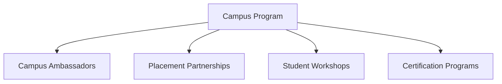

# Career-Agents Campus Program Specification

This document details the strategy and structures for the **Career-Agents Campus Program**, bridging our open-source Career OS with universities, college placement cells, training institutes, and student clubs.

---

## 🏛️ Program Architecture

We scale campus engagement through 4 main initiatives:

### 1. Campus Ambassador Program
- **Objective:** Select student leads to build local developer chapters.
- **Responsibilities:**
  - Host hackathons and agent sprints on campus.
  - Help students run the validation scripts for custom agent submissions.
  - Distribute release guides and onboarding documentation.
- **Incentives:** Exclusive swag, contributor leaderboard score multipliers, and direct mentorship from core maintainers.

### 2. Placement Cell Partnerships
- **Objective:** Integrate Career OS directly into university placement cells.
- **Features:**
  - Custom sitemaps for campus recruitments.
  - Bulletins detailing target-company interview loops.
  - Automated ATS resume grading templates for college cohorts.

### 3. Student Workshops
- Interactive bootcamps covering:
  - "Designing Custom Agents for Claude Code and Cursor."
  - "Building scalable Data and AI Engineering pipelines."
  - "Mastering technical interview loops using visual workflows."

### 4. Certification Programs
- Offer verified credentials for students:
  - **Certified Agent Engineer:** Awarded upon merging 3+ verified agents into the repository.
  - **Career OS Power User:** Awarded for completing targeted interview mock test loops and portfolio audits.
