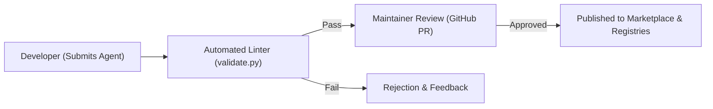

# Community Agent Marketplace Specification

This document describes the specifications and mechanisms for the **Career-Agents Community Marketplace**, enabling developers and career specialists to submit, publish, verify, and discover custom career agents.

---

## 🚀 Marketplace Flow

The marketplace provides a safe, curated pipeline to ensure all third-party agents maintain the repository's high standards before listing.

---

## 🛠️ Key Components & Features

### 1. Publish Agent Portal
- Contributors submit custom agents either through the Desktop app dashboard or by committing files via git.
- The publishing portal parses frontmatter fields (`name`, `description`, `color`, `emoji`, `vibe`) and creates entries in the index.

### 2. Agent Verification States
To maintain quality control, the marketplace classifies agents under three verification tiers:
- **Official (Maintainer-Built):** Core agents built and maintained by CodeMyFYP. Guaranteed to follow all guidelines.
- **Verified (Reviewed & Approved):** Community-submitted agents that have been manually reviewed, tested, and approved by project maintainers.
- **Community:** Public submissions that pass automated validate checks but have not undergone manual review.

### 3. Agent Ratings & Feedback Loops
- Users submit ratings (1 to 5 stars) and write evaluations.
- Rating indices are calculated dynamically using a bayesian average formula:
  $$\text{Bayesian Rating} = \frac{v \cdot R + m \cdot C}{v + m}$$
  Where $v$ is user votes count, $R$ is average agent rating, $m$ is minimum votes threshold, and $C$ is repository-wide average score.

### 4. Featured & Trending Algorithmic Feeds
- **Featured Agents:** Curated selection highlighting high-fidelity, maintainer-picked templates.
- **Trending Feed:** Calculated weekly using a decay function based on downloads, ratings increase, and forum references.

### 5. Community Collections
- Users group agents into custom lists (e.g. "My FAANG Prep Toolkit" containing `mock-interviewer`, `system-design-coach`, and `google-interview-coach`) and publish these collections for public download.
