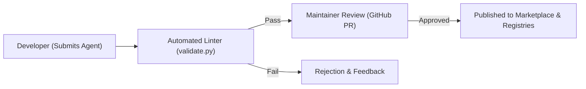

# Community Agent Marketplace Specification

This document describes the specifications and mechanisms for the **Career-Agents Community Marketplace**, enabling developers and career specialists to submit, publish, verify, and discover custom career agents.

---

## 🚀 Marketplace Flow

The marketplace provides a safe, curated pipeline to ensure all third-party agents maintain the repository's high standards before listing.

---

## 🛠️ Key Components & Features

### 1. Submit Agent Form
- Contributors can submit agents directly through the Desktop client or by opening a GitHub Pull Request.
- **Payload Requirements:**
  - Standard markdown agent file.
  - Frontmatter properties: `name`, `description`, `color`, `emoji`, `vibe`.
  - Target division directory assignment.
  - Associated search tags.

### 2. Automated Validation Pipeline (Linter)
- Staged commits run through the repository's validation engine:
  - Validates markdown headings structure.
  - Verifies minimum word count threshold (1,500+ words).
  - Checks JSON schemas of registries.
  - Detects duplicate identifiers.

### 3. Maintainer Verification Flow
- Verified agents carry a distinct status badge in the UI:
  - `official`: Built and maintained by CodeMyFYP.
  - `verified`: Community-contributed but reviewed, tested, and approved by repository maintainers.
  - `community`: General community submissions (subject to basic automated checks only).

### 4. Featured Agents & Ratings
- **Ratings Engine:** Users rate agents based on performance, clarity, and effectiveness. Rating scores are aggregated dynamically.
- **Featured Section:** Highlights top-performing, high-rated, or trending career coaches on the marketplace home screen.

---

## 🏛️ Directory & Metadata Categorization

Marketplace categories mirror the structured divisions registry:
- **Career Strategy:** Comprehensive planning and job searches.
- **Resume Engineering:** Achievements writing, design layouts, and ATS keywords.
- **Interview Prep:** Mock interviewing, behavioral answers, and design review.
- **Networking:** Digital relationships, referral templates, and outreach.
- **Engineering:** Stack architectures and code audits.
- **Startup & Product:** Founder mentoring, MVPs, and market loops.
- **Projects & Research:** Final Year Projects, research methodologies, and defenses.
