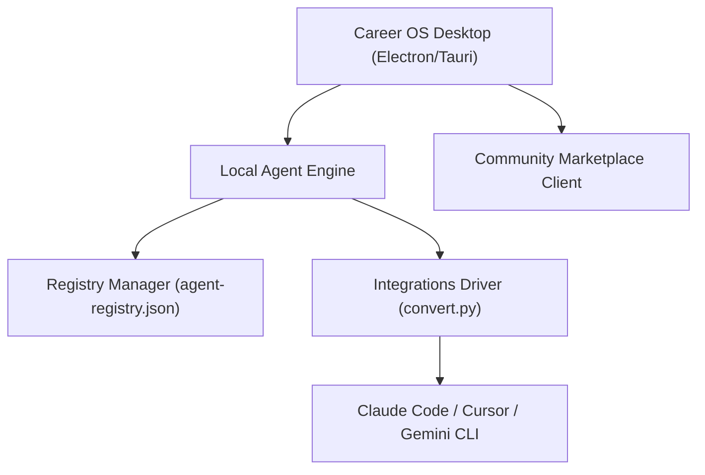

# Career OS Platform Architecture

This document defines the architectural specifications for the **Career-Agents Desktop Application** and the underlying **Career Operating System (Career OS)** framework.

---

## 🏗️ System Architecture

The Career OS Platform is divided into a three-tier architecture that bridges local editor runtimes, the local desktop container, and the community marketplace.



### 1. Presentation Layer (Desktop Application)
- **Runtime Container:** Built using Tauri (Rust + Webview) to ensure a lightweight (under 15MB) package footprint with low memory utilization.
- **Frontend Stack:** HTML5 + Vanilla CSS + ES6 Modules. Features a responsive, glassmorphic dark mode layout styled to highlight agent rosters and workflows.
- **Key Modules:**
  - **Agent Browser:** Interactive card grid with live filtering by division, difficulty, and job role.
  - **Workflow Explorer:** Visual node graph displaying agent communication chains and step-by-step deliverable status.
  - **Career Roadmap Viewer:** Chronological timelines showing progression milestones from student/fresher to senior developer.

### 2. Execution Layer (Local Agent Engine)
- **Registry Manager:** Reads and writes to `agent-registry.json` and `divisions.json` to keep local metrics synchronized.
- **Integrations Driver:** Interfaces with the repository's installer (`install.sh`, `install.ps1`) and converter (`convert.sh`, `convert.py`) modules.
- **Configuration Hooks:** Generates environment variables and files (e.g. `.cursorrules`, Claude Code agent manifests) in target workspaces.

### 3. Distribution Layer (Marketplace)
- **Marketplace API:** Remote REST endpoint that fetches verified community agent configurations and submits new templates.
- **Package Manager:** Handles downloading, version check, and automatic installation of community-contributed agents.

---

## 🛠️ Key Platform Features

### 1. Agent Browser & Search Engine
- **Full-Text Sourcing:** Matches queries against agent IDs, names, tag arrays, and descriptions.
- **Multi-Dimensional Filters:**
  - **Division:** Filter by career, resume, interview, networking, company-interviews, engineering, startup, or projects.
  - **Skill Set:** Specific domains (e.g. React, MERN, Cloud, ATS Optimization).
  - **Career Stage:** Entry-Level, Associate, Mid-Career, Senior, Lead.
  - **Difficulty:** Introductory, Intermediate, Advanced.

### 2. One-Click Installation
- Instantly maps agent markdown structures into third-party target configurations:
  - **Claude Code:** Creates a JSON manifest under the local projects folder.
  - **Cursor:** Automatically injects the formatted system prompt into `.cursorrules` or `.cursor/rules/`.
  - **Gemini CLI:** Appends the manifest path directly to the execution pipeline.

### 3. Career Roadmaps & Workflow Pipelines
- Chains multiple agents together into an operational pipeline.
- Example: The Freshers Placement Pipeline:
  ```mermaid
  sequenceDiagram
      placement-coach ->> resume-keyword-optimizer: Build draft resume
      resume-keyword-optimizer ->> resume-formatting-specialist: Format and optimize ATS
      resume-formatting-specialist ->> linkedin-outreach-specialist: Settle messaging draft
      linkedin-outreach-specialist ->> mock-interviewer: Rehearse behavioral loops
  ```

### 4. Marketplace Integration
- Unified portal inside the desktop container to submit custom agents, browse community ratings, and download updates.
