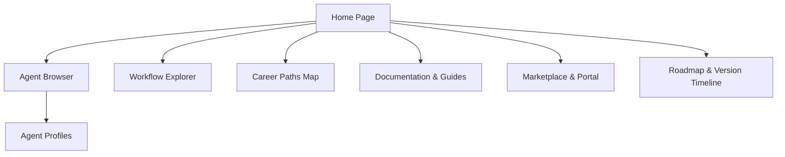

# Career-Agents Web Portal Architecture

This document defines the architectural layouts and frontend/backend configurations for the **Career-Agents Web Portal**.

---

## 🎨 Layout & Sitemap

The portal functions as a high-fidelity Single Page Application (SPA) designed to act as the primary visual user interface of the platform.

### Core Pages
1. **Home:** Introduction banner, tags cloud, trending agents, and platform metrics.
2. **Agents:** Live card index with searchable properties and custom filter configurations.
3. **Divisions:** Category hub grouping agents by technical domains.
4. **Workflows:** Interactive visual flowchart editor and runner.
5. **Agent Search:** Advanced multi-filter search inputs.
6. **Career Paths:** Comprehensive career journey guidelines (e.g. Fresher-to-SDE).
7. **Documentation:** Structural standard specifications and developer guidelines.
8. **Contributors:** Project leaderboard and onboarding guides.
9. **Marketplace:** Submissions form, rating statistics, and download catalog.
10. **Blog:** Success stories, API reviews, and product features announcements.
11. **Roadmap:** Milestones roadmap dashboard.
12. **About:** Project history and core mission.

---

## 🛠️ Feature Specifications

### 1. Interactive Agent Profiles
Each agent receives a dynamic profile containing:
- Code copy block.
- Markdown to JSON exporter.
- One-click loading button for Cursor, Claude Code, and Gemini CLI.
- User reviews and rating scores.

### 2. Multi-Filter Sidebar
Allows users to refine search queries by:
- **Division:** career, engineering, startup, etc.
- **Experience Level:** Entry, Associate, Mid-Senior, Lead.
- **Skill Set:** Python, LLMs, Docker, etc.
- **Company Target:** Google, Amazon, Meta, etc.
- **Save Favorites:** LocalStorage integration allowing users to bookmark and save specific agents.
